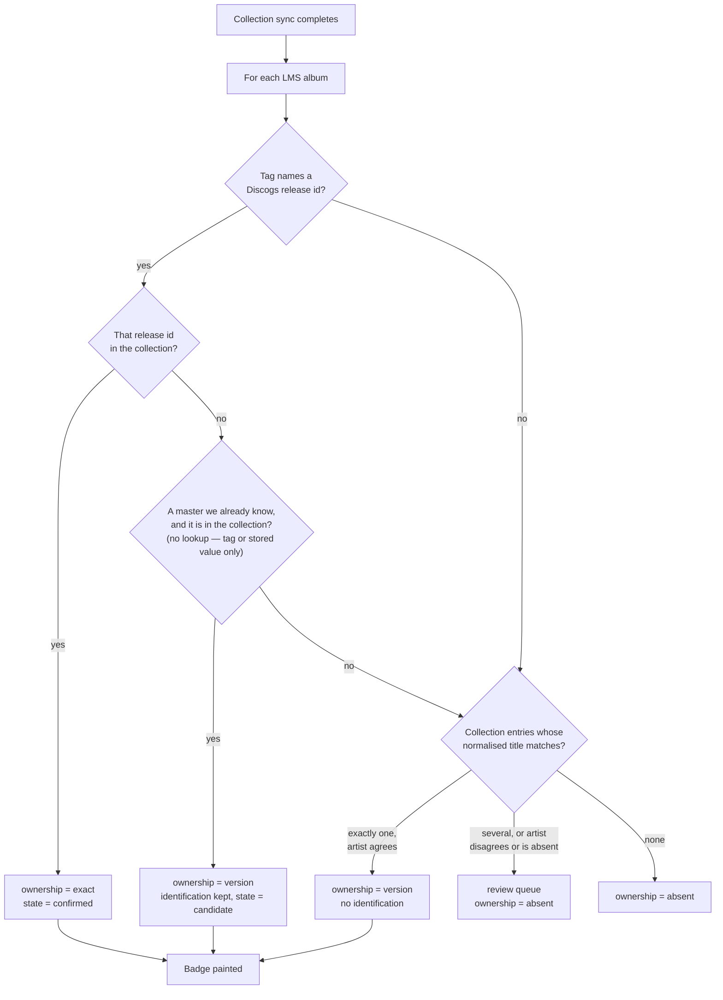
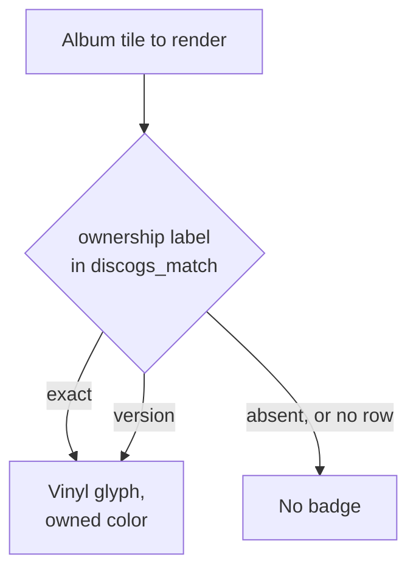
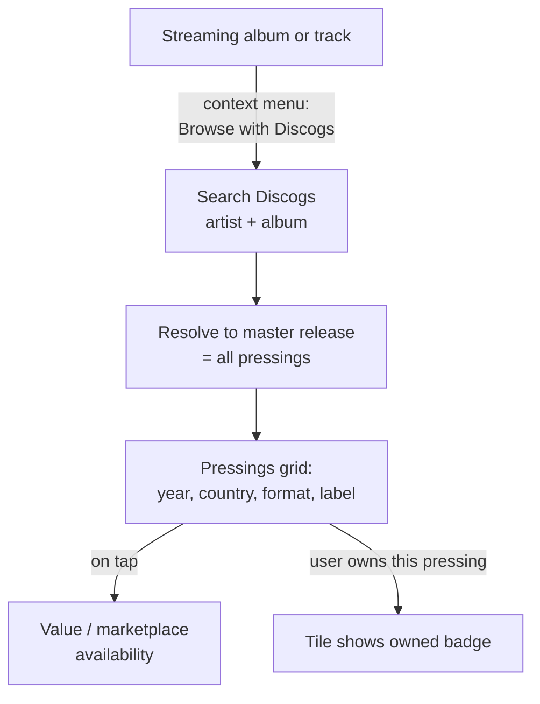
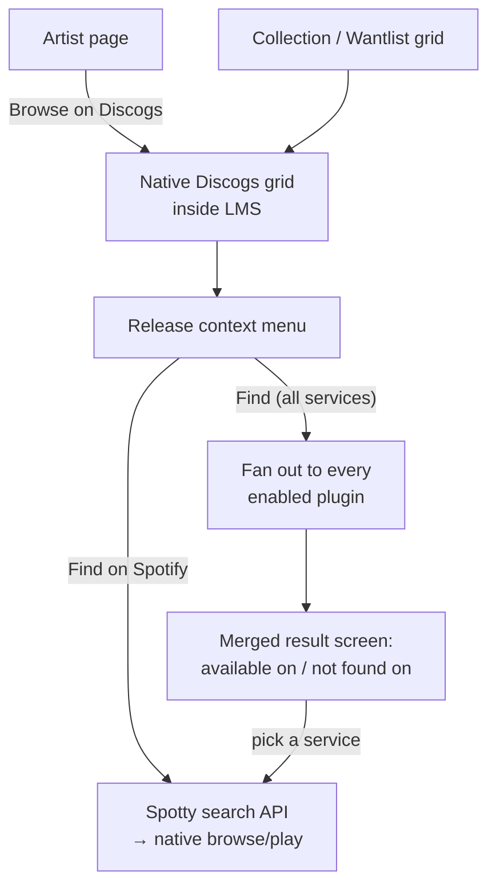

# SqueezeWax — Design Reference

> **Partly superseded, reconciliation pending — 2026-09-12.**
> Decisions §13 and §13.10 replaced v1's matching design: identification
> now runs against the user's own Discogs collection rather than a
> per-album Discogs search, the `local_tracks == 0` gate is removed, only
> Strict auto-confirms an exact release, and version ownership badges on
> an unambiguous title-and-artist match. The sections marked below have
> not yet been rewritten. Where this document and decisions §13 disagree,
> **decisions §13 is current** — this is a temporary inversion of
> working-agreement §2's precedence rule and is itself the defect being
> tracked. These markers come out when the reconciliation lands.

Design ideas and decisions for **SqueezeWax**, a Discogs plugin for Lyrion
Music Server (LMS), collected from brainstorming sessions (August 2026).

**Correction labels.** Inline corrections in this document are dated and
labelled. The labels are not interchangeable:
*falsified* — measurement disproved the claim;
*superseded* — the claim was true but a later decision replaced it;
*defect found* — the claim was always wrong, nothing external changed;
*corrected* — a figure moved; the claim's shape did not.
Corrections stay inline rather than moving to an appendix: reading a claim
next to what was believed and why it was wrong is what stops the error
being reasoned back into existence.

---

## 1. Background & Research Findings

- **No Discogs plugin exists** in the official LMS plugin directory
  (https://lyrion.org/plugins/directory/) — verified against the full directory.
- Discogs data currently reaches LMS only indirectly:
  - **Music and Artist Information (MAI)** plugin (Michael Herger) uses Discogs
    as one of several sources (alongside Wikipedia, AllMusic, Last.fm) for
    artist pictures and metadata.
  - **extGUI4LMS** (alternative, now-inactive web interface, last active
    ~2016) offered basic Discogs lookup via a user-supplied API token —
    pulling release/artist metadata and cover art (including back covers)
    into its browse view. No ownership tracking, matching, or collection
    features — a good illustration of how thin prior Discogs integration
    has been, not a competing project.
- **Precedent for the badge/browse patterns exists** (verified via screenshots):
  - Streaming plugins (Spotty/Spotify, Deezer) badge album tiles in grid view
    with a service logo overlay in the artwork corner. Badging happens
    per-album-edition (two editions of the same album can differ: one badged,
    one not).
  - Artist pages include a "Browse on Spotify" menu entry alongside
    Albums / EPs / Singles / Compilations / Appearances.
  - Service source is recorded at **library scan time** via each plugin's
    `Importer.pm` (e.g. Spotty registers the `spotify:track:` URI prefix and
    imports the user's Spotify library into "My Music" during the scan).

### Reference: LMS music-service plugin structure

Typical plugin layout (per lyrion.org/reference/music-service-plugin/):

| File | Purpose |
|---|---|
| `Plugin.pm` | Entry point; initializes settings, importer, protocol handler |
| `API.pm` | Shared Discogs API code (URLs, data transforms) |
| `API/Async.pm` | Non-blocking calls (server side; LMS is single-threaded) |
| `API/Sync.pm` | Synchronous calls (scanner/importer side) |
| `Importer.pm` | Scan-time import/matching (synchronous HTTP only) |
| `Settings.pm` | Configuration pages |
| `Settings/Auth.pm` | Discogs personal-access-token entry and storage |

### Naming (resolved)

- **Chosen name: SqueezeWax.**
  - Package namespace: `Plugins::SqueezeWax::` (per LMS convention — the
    package name is reused as the plugin's identifier in the repository
    listing).
  - Follows the existing community naming pattern (SqueezeCloud, SqueezeSonic)
    rather than fusing "Discogs" into the plugin's own name.
  - Optional repository display title: **"SqueezeWax for Discogs"** — see
    brand-usage restrictions below for why this suffix form, specifically, is
    the safe way to reference Discogs in the name if desired.
- **Rejected candidates:**
  - *CrateDigger* — "Crate Diggers" is itself one of Discogs' own protected
    marks (alongside NearMint, VinylHub, etc.), listed in their Application
    Name and Description Policy as **not** available for third-party use.
  - *CrateLink* — name collision with an existing, actively maintained
    product: a Serato-crate-syncing mobile app of the same name
    (cratelink.app), live on the App Store. Same domain (music-library
    tooling), real confusion risk.
  - *SqueezePress* — rejected on plain English grounds rather than
    trademark/collision grounds: "squeeze" and "press" are near-synonyms, so
    the name reads as a tautology and obscures the intended "record
    pressings" meaning.
  - *SqueezeShelf*, *SqueezeGroove*, *MyShelf*, *MyCrate* — considered,
    not chosen (author preference); SqueezeShelf and SqueezePress were the
    most format-neutral options (vinyl/CD/cassette alike) but lost out to
    SqueezeWax on preference. MyShelf/MyCrate were not collision-checked, as
    they were dropped before that step.
  - No formal trademark-registry search was performed for any candidate;
    checks were web searches for existing products/software in active use,
    which is what matters practically for a free open-source LMS plugin.

### Discogs brand-usage restrictions (verified against Discogs policy)

Source: Discogs' [Application Name and Description Policy](https://support.discogs.com/hc/en-us/articles/360009207054-Application-Name-and-Description-Policy)
(effective Dec 11, 2019). These restrictions bind **any** place the plugin's
name, description, or UI references Discogs — not just the package name —
including the badge and its context menu (§4).

**"Discogs mark" is defined broadly**: the Discogs name, the Discogs logo, or
any word/phrase/image that identifies the source of the Discogs service. This
is why the badge glyph decision in §4 (generic vinyl icon, not the Discogs
"D" logomark) is a policy requirement, not just a stylistic choice.

**Not allowed, anywhere in the plugin's name, description, or branding:**
- Combining any part of "Discogs" with the plugin's own name, marks, or
  generic terms (rules out forms like "Discogs App", "My Discogs", "Discogs
  Collector", "Catalog by Discogs" — Discogs' own listed bad examples).
- Names or logos that imitate or could be confused with Discogs' marks.
- Presenting Discogs' marks/assets as the most distinctive or prominent
  feature of anything the plugin creates or displays.
- Using any of Discogs' *other* protected marks: "NearMint," "Crate
  Diggers," "Bookogs," "Comicogs," "Filmogs," "Gearogs," "Posterogs," or
  "VinylHub."

**Allowed:**
- Accurately describing integration, e.g. "Log in with Discogs," "View your
  Discogs Collection," "Access your Discogs Wantlist" — safe wording for
  Settings/Auth screens (§9) and the badge context menu (§4).
- Referencing Discogs in the plugin's *display* name via a trailing "for
  Discogs" suffix after a unique, unrelated name — Discogs' own sanctioned
  examples are "Vinyl Catalog for Discogs" and "Collect for Discogs." This is
  the only endorsed way to put "Discogs" in the name itself.

**Practical takeaway for implementation**: keep "SqueezeWax" as the standalone
name everywhere (package, menus, repository listing); use plain descriptive
phrases ("Discogs Collection," "Discogs Wantlist," "View on Discogs") for
functional labels; never render the Discogs logo/wordmark as the badge or
anywhere the plugin's own branding would sit alongside it in a way that could
suggest partnership or endorsement.

---

## 2. Core Concept

> **Partly superseded (decisions §13.3, §13.10.2).** Ownership now comes in two
> strengths — *exact* (the collection holds this release) and *version* (it
> holds a different release under the same master) — so "the owned pressing"
> in item 1 below is only the exact case. Items 2 and 3 are unaffected.

The plugin connects a user's **physical record collection** (tracked on
Discogs) with their LMS library (local rips + streaming services), in both
directions:

1. **Ownership awareness** — see at a glance which albums in LMS you own
   physically; inspect details and value of the owned pressing.
2. **Marketplace lookup** — on demand, check availability and price range of a
   release on the Discogs marketplace.
3. **Cross-browsing** — jump from a streaming album to its physical editions on
   Discogs, and from a Discogs discography back into streaming plugins.

The plugin never plays audio itself. Discogs is treated as a music-service
plugin **for a catalog you don't stream from** — it only links out (buy,
browse, play elsewhere).

---

## 3. Matching: Linking LMS Albums to Discogs Releases

Matching answers two questions that are not the same question, in two passes
that run at different times.

**Identification** — *which Discogs release is this album?* Runs at library scan
time, per album, inside `Importer.pm`, from the album's own file tags. It skips
an album whose files have not changed since the last attempt, keyed on
`source_timestamp` (§10).

**Ownership** — *does the user own this record?* Runs as a separate pass,
triggered by a completed collection sync rather than by a scan. It **does not**
use the file-state skip: buying a record changes nothing on disk, so an album
whose files are untouched is exactly the album whose ownership may have changed.
A rescan alone never recovers a badge; a sync does. The sync's own triggers are
in §9.

The two passes write into one row, and the conclusion is the tuple

`album_key → discogs_release_id, discogs_master_id, ownership, match_tier,
state, matched_at`

with the ownership label and the identification kept in separate columns because
they answer separate questions. See §10 for the columns and
`squeezewax-v1-decisions.md` §13.3 for why conflating them fails.

`album_key` — a hash over the album's tracks' `urlmd5`, sorted — is the
match's identity, not `lms_album_id`. LMS's own `albums.id` is
`INTEGER PRIMARY KEY AUTOINCREMENT` and does not survive a `library.db`
wipe; `urlmd5` is LMS's own cross-wipe key (see §10, and
`squeezewax-v1-decisions.md` §2 for the full finding). `lms_album_id` is
still cached alongside for fast lookups, refreshed whenever a rescan
completes, but is never treated as identity.

### Two routes, and they conclude different things

The v1 flow is collection-first: the user's own Discogs collection is synced,
and LMS albums are matched against it. There is no per-album search of the
Discogs database. Reasoning, and the measurement that produced it, in
`squeezewax-v1-decisions.md` §13.1 and §13.10.

| Route | What it reads | What it concludes |
|---|---|---|
| **Strict** | A configured tag on the album's files naming a Discogs release id | An **identification**. Ownership only if that same id, or its master, is in the collection |
| **Collection** | The synced collection, by title then artist | An **ownership** conclusion. Never an identification — it does not say which pressing |

Neither route searches Discogs, and neither reads track durations. Structural
and Fuzzy matching are gone: both were narrowings of a whole-database search
that no longer runs (`squeezewax-v1-decisions.md` §13.8).

**Every album is in scope**, including albums with no local files at all. The
old `local_tracks == 0` gate came from duration fingerprinting, which needed
files to read durations from; a title comparison needs none. On the reference
library the gate excluded 186 of 765 albums, and removing it matched 10
additional owned records (`squeezewax-v1-decisions.md` §13.10.1).

**Title comparison normalises no further than case-folding and whitespace
collapse.** Both sides are decoded to character strings first; then leading and
trailing whitespace is trimmed and internal runs collapsed to one space; then
case is folded. Punctuation-stripping, article-stripping and bracket-suffix
removal are **not** used — measured, punctuation-stripping gained one album and
produced one wrong badge, which is a bad trade at 1:1
(`squeezewax-v1-decisions.md` §13.10.4).

**Artist gates every auto-badge and is not a tiebreak.** An ownership conclusion
from the collection route requires exactly one collection entry agreeing on both
title *and* artist. Several candidates, artist disagreeing, or artist absent on
either side: the album goes to the review queue instead of badging
(`squeezewax-v1-decisions.md` §13.10.3).

### Matching pipeline (flowchart)



The tests are ordered, and the order is the point: a tag the user supplied
themselves outranks a title comparison. An album that reaches **H** carrying a
tag keeps its identification — `discogs_release_id` and `match_tier = 'strict'`
stay as they are, and only `ownership` is written by the collection route.

**No step in this flow makes a Discogs request.** Identification reads tags from
files the scanner is already opening; ownership reads the collection the sync
has already fetched. Node **F** uses a master id only where one is already known
— from a configured master tag, or stored on the row from an earlier match — and
never looks one up, because a per-album lookup is the cost
`squeezewax-v1-decisions.md` §13.1 removed.

**A badge does not require a confirmed state, a tag, or a local file.** Path
**I** is the common one: 87 of 96 matches on the measured page auto-badged, most
of them by this route (`squeezewax-v1-decisions.md` §13.10.2, §13.10.4).

**K writes no row.** Absence of a row already means "nothing known", so an album
identifying nothing and owning nothing is not recorded
(`squeezewax-v1-decisions.md` §14.8).

**The pass must be deterministic.** The collection payload is discarded after
the sync (§10), so a re-sync re-derives every conclusion from scratch. The same
collection against the same library must reach the same answers, or badges
change between syncs with no visible cause.

1. *Tagged, and owned.* A ripped CD tagged `DISCOGS_RELEASE_ID=1234567`. The
   scanner reads the tag; the sync finds 1234567 in the collection →
   **ownership `exact`, state `confirmed`**, badge painted. The expected path
   for a well-tagged rip of a record the user owns.

2. *Tagged, and owned in a different pressing.* The tag names release 123; the
   collection holds release 456, a different pressing of the same master. The
   user owns the record, not that pressing → **ownership `version`**, with the
   identification left alone: `discogs_release_id` stays 123, `match_tier`
   stays `strict`, state stays `candidate`. Badge painted. NULLing the release
   id here would destroy an identification the user supplied
   (`squeezewax-v1-decisions.md` §13.3).

3. *No tag, no local files, and owned.* A streaming-only album. Exactly one
   collection entry agrees on normalised title and on artist → **ownership
   `version`, no identification at all**: NULL release id, NULL `match_tier`,
   NULL state. Badge painted. This whole population was excluded from matching
   before `squeezewax-v1-decisions.md` §13.10.1 removed the `local_tracks == 0`
   gate — 186 of 765 albums on the reference library, of which 10 turned out to
   be owned.

4. *One record, two albums.* A rip and a stream of the same record are two LMS
   albums matching one collection entry. **Both badge.** This is the expected
   shape, not a collision to resolve — measured 9 of 10 cases in that direction
   (`squeezewax-v1-decisions.md` §13.10.3). The ambiguous direction is the other
   one: one LMS album matching several collection entries, measured once in 765,
   which goes to the queue.

5. *Title agrees, artist does not.* A collection entry and an LMS album share a
   title, but the artists disagree or one side has no artist at all. **No badge
   — review queue.** Measured 8 of 96 matches. Artist gates every auto-badge
   rather than only breaking ties (`squeezewax-v1-decisions.md` §13.10.3).

   The stricter behaviour is deliberate. *Substrata* and *Substrata²* are
   different Biosphere records, and artist cannot separate them; the
   normalisation rung was chosen so that they do not share a key and the second
   simply does not match. A missing badge is preferred to a wrong one
   (`squeezewax-v1-decisions.md` §13.10.4).

### Match states per album

`state` describes the **identification** only. Ownership is a separate column
and is not encoded here (§10).

1. **Unmatched** — no identification was made. Either there is no row at all,
   or there is a row carrying only an ownership conclusion, with NULL `state`,
   NULL `match_tier` and NULL `discogs_release_id`. Walkthrough 3 is the second
   form (`squeezewax-v1-decisions.md` §14.8).
2. **Candidate** — an identification exists that the collection has not
   corroborated. Reached by every tagged album whose release id is not in the
   collection, which is most of a library. Two Strict variants remain,
   distinguished by `discogs_release_id`: NULL means "we examined this and could
   not decide" — a tag conflict — and non-NULL means "we propose this". The
   second arises when a conflict demotes a previously confirmed row: the
   adjudicated id is kept, because a decision survives
   (`squeezewax-v1-decisions.md` §2a), while the demotion stops the badge
   immediately.
3. **Confirmed** — the tagged release id is present in the collection, or the
   user linked the album by hand (`squeezewax-v1-decisions.md` §13.4).

**`candidate` does not mean "in the review queue".** Most candidates are simply
albums the user does not own, and nothing needs deciding about them. The queue's
contents are enumerated in `squeezewax-v1-decisions.md` §13.10.5 and are a much
smaller set. Anything selecting queue items on `state = 'candidate'` is wrong.

**Badge derivation** (see §4): the badge reads the `ownership` column. There is
no join and no render-time test — the ownership pass has already decided, and a
badge paints for `exact` and `version` alike. Confirmation is not required.

### Confirmation & feedback loops

- The review queue offers search-as-you-type against Discogs to link an album to
  a specific pressing by hand; confirming writes `match_tier = 'manual'` and
  `state = 'confirmed'`. A manual link is the user's own decision and is not
  subject to the collection cross-check that governs Strict.
- **The queue must also offer reject / dismiss, not only confirm.** One state
  the importer can create is otherwise terminal: a confirmed match demoted to
  candidate by a tag conflict keeps its adjudicated `discogs_release_id` and its
  snapshots (`squeezewax-v1-decisions.md` §3a), and if the user then removes the
  tags altogether the importer may not delete it — the row carries a decision,
  and §2a forbids that. Nothing else will clear it, so with a confirm-only queue
  the album would propose a release with no tag behind it forever. A human has
  to be able to say no.
- **A wrongly auto-badged album has no recovery path in v1.** Ownership `version`
  is written without a confirmation step, so such an album never reaches the
  queue and there is nothing to reject. v1 assumes a well-tagged library and a
  maintained Discogs collection; the fix is to correct the collection or the
  tags. Measured zero wrong badges at the chosen normalisation rung
  (`squeezewax-v1-decisions.md` §14.4, §13.10.4).
- A successful manual "Find on Spotify" (see §6) can retroactively backfill /
  promote the original scan-time match.

### Multi-disc releases & box sets

No special rule. A multi-disc release or box set is matched by title and artist
like any other album, and its ownership is a collection fact rather than a
property of its discs.

The former rule — a box set confirmed only if every disc matched on track count
and per-track duration — belonged to Structural matching, which no longer exists
(`squeezewax-v1-decisions.md` §13.4, §13.8). Whether duration comparison returns
later as a *ranker* among candidates, rather than as a verdict, is open and is
not v1 (`squeezewax-v1-decisions.md` §13.8).

### Re-match triggers

The two passes are triggered separately, and the difference matters.

**Identification** re-runs when:

- the album is **new** at scan time (no `discogs_match` row);
- its **tags changed** since the last scan, detected via LMS's own changed-file
  handling during rescan — the old identification is invalidated and Strict runs
  again;
- the user triggers a **manual "re-match"** from the album's Discogs context
  menu;
- a **"clear & rebuild matches"** maintenance action in §9 wipes the match table
  and re-runs from scratch.

Confirmed identifications are otherwise **stable across rescans**: a routine
rescan does not re-examine an album whose files have not changed.

**Ownership** re-runs whenever a collection sync completes, for every album —
**there is no file-state skip**. Buying a record changes nothing on disk, so an
album whose files are untouched is precisely the album whose ownership may have
changed; skipping it would mean a badge that never appears until the user edits
a tag (`squeezewax-v1-decisions.md` §13.6). A sync is three requests for a
203-item collection and takes seconds, so re-deriving every conclusion is
cheaper than tracking which ones could have moved.

The sync itself has three triggers — scan start, a configurable interval, and a
manual button in Settings — set out in §9 and
`squeezewax-v1-decisions.md` §13.7.

### Constraints

- Discogs API rate limit: see §13 for the authoritative figure and how it
  was verified. Large-library scans must be batched/throttled; results
  cached in a local SQLite table so re-scans are cheap.
- Matching a Discogs *pressing* to LMS tracks is inherently ambiguous when only
  generic tags exist — hence the tier system rather than one algorithm.

---

## 4. Badge (Ownership Indicator)

- **Where**: corner overlay on album artwork, in
  - grid view while browsing, and
  - the Now Playing screen (smaller).
- **Which corner**: the Discogs badge sits in the artwork corner **opposite**
  the streaming-service badge (e.g. if Spotify/Deezer badge the
  bottom-right/top-right corner, Discogs occupies the left-side corner) —
  the two can coexist on the same tile without overlapping.
- **When**: for albums whose `ownership` label is `exact` or `version` (§10).
  The label is written by the ownership pass (§3); the badge does not compute
  it, does not require a confirmed match, and does not require the album to
  have a tag or a local file. An album owned only as a *version* — the user
  owns the record, not that pressing — badges identically to an exact match;
  the distinction appears in the context menu, not in the artwork
  (`squeezewax-v1-decisions.md` §14.5).
- **What**: a **vinyl-record glyph** (not the Discogs "D" logomark) — kept
  generic/iconographic rather than using Discogs' own brand mark, to sidestep
  branding-guideline questions the way the marketplace-linkout approach
  already does. **This is a policy requirement, not just a style choice**:
  Discogs' Application Name and Description Policy defines "Our Discogs mark"
  to include the Discogs logo and any image/designation identifying their
  service, and prohibits presenting their marks as the most prominent
  feature of what a third-party app creates (see §1, naming section). A
  badge rendered as the Discogs "D" logomark on every owned album tile would
  sit squarely inside that restriction; the generic vinyl glyph does not.
- **Rendering is skin-independent by design**: the intent is a single overlay
  mechanism that works the same way regardless of skin (default web UI,
  Material Skin, etc.), rather than a per-skin reimplementation. This still
  needs to be verified once implementation starts — no confirmed generic
  badge/overlay API was found in LMS core (see "Rendering note" below), so
  whether true skin-independence is achievable, or whether each skin needs
  its own CSS/template hook, is something to validate against actual skin
  source rather than assume.
- **Granularity**: per album *edition* (matching the observed Spotify
  behavior — two editions of the same album can be badged independently).
- **Artist-level badge**: opt-in via Settings, and scoped **only to artists
  present in the user's Discogs Collection** (i.e. "I own physical releases
  by this artist") — not the Wantlist. Off by default to avoid the extra API
  calls unless the user opts in.

### Owned vs. Wantlist — visual distinction (resolved)

**This is a v2 concern (§11).** v1 has one badge state — owned — so the
derivation above has one branch. The distinction below applies once the
wantlist badge ships.

- **Same vinyl glyph for both states, distinguished by color.**
- Both the "owned" color and the "wantlist" color are **user-configurable in
  Settings** (see §8), rather than fixed.

### Badge-state derivation (flowchart)



One read of one column. There is no join, no collection table to consult, and
nothing to decide at render time — the ownership pass decided when the sync
completed (`squeezewax-v1-decisions.md` §13.2, §13.3).

**Example walkthrough:** Grid view renders a tile for *Blue Train*. The match
row's `ownership` is `version` — the last sync found one collection entry
agreeing on title and artist, though no tag names a pressing — so the tile gets
the vinyl glyph in the user's configured "owned" color, in the corner opposite
the Spotify badge. A rip and a stream of the same record are two LMS albums
against one collection entry, and **both badge**: one owned record, two tiles,
the same glyph on each (`squeezewax-v1-decisions.md` §13.10.3).

### Rendering note

No evidence found that LMS core provides a generic badge/overlay mechanism —
the Spotify badge appears to be plugin/skin-drawn. The Discogs plugin will
draw its own overlay via template/CSS hooks for the default web UI. Given the
skin-independence goal above, this should be re-examined during
implementation to confirm the same hook/approach genuinely applies across
skins (e.g. Material Skin) rather than requiring a distinct integration path.

### Licensing caveat

Spotify's branding guidelines prohibit placing logos/overlays **on artwork
provided by Spotify**. Locally scanned/ripped artwork is unaffected. If the
badge would sit on Spotify-sourced art, this is a gray area to keep in mind.

### Badge context menu ("Discogs" entry)

Tapping the badge / choosing the Discogs context-menu entry on an owned album
reveals details of the **owned variant**:

- **Ownership and pressing.** Where `ownership` is `exact`, the menu names the
  pressing the user owns. Where it is `version`, the menu says the user owns
  the record but not which pressing. This is where the exact-versus-version
  distinction surfaces, since the badge itself does not draw it
  (`squeezewax-v1-decisions.md` §13.3, §14.5).
- **Pressing details, credits, estimated value and the Discogs link-out need a
  resolved pressing** — one supplied by a tag or by a manual link. An album
  owned by *version* alone has none, and v1 does not retain the collection
  entry's release id, so those four are **absent rather than empty** for it
  (`squeezewax-v1-decisions.md` §13.2, §14.10). **"Re-match…" is always
  available**, and is the action that resolves a pressing where none is known.
- Pressing details: format (vinyl/CD/cassette), catalog #, label, country, year
- Credits (musicians, producers, engineers — a Discogs strength)
- Current estimated value (fetched on demand)
- "View on Discogs" link-out
- **"Re-match…"** — manual re-match action (§3, re-match triggers)

All Discogs-referencing labels here ("View on Discogs," etc.) use the
descriptive phrasing pattern permitted under Discogs' brand-usage policy
(§1) — plain factual references to the integration, not stylized use of
their mark.

---

## 5. Collection Value & Statistics

> **The sync description is superseded (decisions §13.1, §13.2).** The
> collection sync is three requests for a 203-item collection, not a slow
> background job, and it caches nothing — each page is matched in memory and
> discarded. The features below are unaffected.

Requires a Discogs **personal access token** (`Settings/Auth.pm`); pulls the
user's Collection (and optionally Wantlist) into a local cache via a slow
background sync job (rate-limit-aware).

### Features

- **Total estimated collection value** — sum of Discogs' suggested prices,
  shown as a low/median/high range (Discogs provides a spread, not one number).
- **Value trend over time** — Discogs' API provides no historical prices, so
  the plugin snapshots prices periodically and builds its own history table
  (chartable).
- **Stat cuts**: value by genre, decade, label; most valuable items;
  "sleepers" (largest appreciation since added).
- **Cross-reference with LMS library**:
  - records owned but never ripped/scanned into LMS ("not playable"),
  - digital-only albums with no physical counterpart,
  - a "collection completeness" view (how much of the physical collection is
    playable through LMS).

### Currency normalization (resolved)

- **Default display: Discogs' own native/listed currency per marketplace
  entry** — no forced conversion or aggregation by default.
- **Settings option to recalculate into another display currency** on demand
  (see §8) for users who want a single normalized total. The conversion rate
  source itself still needs to be chosen/verified against an actual FX-rate
  API during implementation, rather than assumed here.

### Caveats

- Prices are per-marketplace and per-currency; aggregation needs normalization.
- Community-edited data quality varies (strongest for vinyl/electronic niches).

---

## 6. Cross-Browsing (Two Inverse Flows)

### Flow 1: Streaming → Discogs — "what physical editions exist?"

- **Trigger**: context menu on any streaming album/track → **"Browse with
  Discogs"**.
- **Resolution**: search Discogs by artist+album and resolve to the **release
  group** (master release = all pressings), not one pressing.
- **Result**: grid/list of pressings — year, country, format, label — with
  value / marketplace availability inline or on tap.
- Read-only and ownership-independent; but if the user **owns** one of the
  listed pressings, that tile shows the owned badge (shared visual language
  with §4).



**Example walkthrough:** *I listen to Spotify. I hear a nice song. I browse
to the album. I want to know what physical releases exist.* From the album's
context menu I choose **Browse with Discogs**. The plugin searches Discogs
for artist + album, resolves to the master release, and shows a grid of all
pressings — the 1971 UK first press, the 1994 CD reissue, the 2019 180g
repress — each with year, country, format, and label. Tapping one shows its
value and marketplace availability. If one of the listed pressings happens to
be in my Collection, that tile carries the owned badge.

### Flow 2: Discogs → Streaming — "where can I listen to this?"

- **Trigger A — artist page**: a **"Browse on Discogs"** entry in the artist
  menu (same slot as "Browse on Spotify"). **Resolved: opens a native grid of
  the artist's Discogs releases inside LMS** (the richer option), rather than
  linking out to a browser.
- **Trigger B — native Discogs grid**: browsing the user's Collection,
  Wantlist, or an artist discography as a Discogs-sourced grid inside LMS.
- **Context menu per release/track**:
  - **"Find on Spotify" / "Find on YouTube" / "Find on Qobuz" …** — targeted;
    calls that one plugin's search API with artist+title and hands off to its
    native browse/play flow.
  - **"Find"** (unqualified) — fans out to **all enabled** streaming/service
    plugins at once and shows a merged result screen
    ("Available on: Spotify, YouTube — not found on: Qobuz").
- **Decision**: "Find" shows a merged screen rather than auto-jumping to the
  first hit — per-service matches can be ambiguous too (the matching problem
  recurs on the way out).
- Depends on target plugins exposing searchable APIs (Spotty etc. likely do,
  since LMS global search already spans services).



**Example walkthrough:** *Same starting point as Flow 1, but now I want to
know which releases come from this artist.* From the artist page I choose
**Browse on Discogs** and get the artist's full Discogs discography as a
native grid inside LMS. I spot an interesting album I've never heard. From
its context menu I choose **Find on Spotify** — the plugin calls Spotty's
search with artist + title and hands off to Spotify's native browse/play
screen. Or I choose the plain **Find**, and the plugin queries all enabled
services at once, showing "Available on: Spotify, YouTube — not found on:
Qobuz" so I can pick where to listen (no auto-jump, since per-service matches
can be ambiguous too).

### Wantlist integration (resolved)

- **Scope: badge only** (see §4) — Wantlist items are visually flagged
  wherever the badge appears (grid view, Now Playing, cross-browse results),
  distinguished from owned items by color.
- No marketplace-result hint (e.g. "you want this" annotation inside the
  on-demand marketplace lookup screen, §7) for now — out of scope unless
  revisited later.

---

## 7. Marketplace Lookup (On Demand Only)

Explicitly **not** automatic/ambient — fires only when the user triggers it.

- **Trigger**: context menu action, e.g. **"Check availability"**, on any
  release (owned or not, local or streaming or Discogs-grid).
- **Result**: compact summary line — e.g. "14 copies available, $8–$45" —
  expandable into the full filtered listing, each entry linking out to the
  Discogs listing. No in-plugin checkout; link-out only.
- **User-filterable / sortable** (see Settings, §8): format, condition, seller
  rating, sort order, ship-to country.
- Because it is on-demand, rate-limit pressure is low; results can still be
  cached briefly per release.

---

## 8. Failure & Degradation Behavior

> **Three claims here are stale (decisions §13.1, §13.2, §13.6).** There is no
> collection cache — badges render from the stored ownership label; ownership
> does not use the already-matched skip, since it changes without any file
> changing; and matching does **not** survive token revocation, because the
> collection is where identification now happens. Decisions §13.7 adds the
> rule this section is missing: a failed or partial sync leaves the previous
> ownership conclusions untouched.

The plugin must stay usable (and quiet) when Discogs is slow, rate-limited,
or unreachable:

- **Badges** render entirely from the **local cache** (match table +
  collection cache) — no network calls at render time, so badges never
  disappear or stall the UI when Discogs is down.
- **Scan-time writes ride LMS's own transaction.** The scanner sets
  `AutoCommit = 0` once (`scanner.pl:295`) and commits at intervals, so our
  writes are enclosed by it and `Slim::Schema->forceCommit` commits both files.
  The importer commits every 200 albums on top of that, so a hard kill loses at
  most that much work.
- **A user-initiated abort commits rather than discarding.** `exit` inside
  `Slim::Utils::SQLiteHelper::updateProgress` runs Perl's `END` blocks, which
  reach `scanner.pl`'s `cleanup()` and its `forceCommit` before the disconnect.
  So an aborted scan leaves everything matched up to that point **durable**, and
  the next scan skips those albums on `source_timestamp` and continues with the
  rest. Verified on a real server: an abort five seconds into matching left 72
  albums' writes committed — below the 200-album boundary — and the following
  scan examined only the remainder. Resumability is therefore a property of the
  abort path itself, not only of our commit cadence; the cadence covers the
  cases where `END` blocks do not run at all (`SIGKILL`, OOM, power loss). (SQLite's cross-database atomicity does not hold
  when both files are WAL, which both are; that is benign here, since `album_key`
  is derived entirely from `library.db`, so a lost match row just means the album
  is matched again next scan.)
- **Server-side writes are impossible during a scan.** `BEGIN IMMEDIATE`, forced
  by `sqlite_use_immediate_transaction` (`Slim/Utils/SQLiteHelper.pm:358`), locks
  *every* attached database, so the scanner holds a write lock on
  `squeezewax.db` for the whole scan. Reads are unaffected. Server-side actions
  that write — the review queue, manual re-match, settings changes that
  invalidate the match cache — refuse while `Slim::Music::Import->stillScanning`
  and say so, rather than surfacing a lock error.
- **Marketplace lookup / value fetch** (on-demand actions) fail gracefully
  with a short message ("Discogs not reachable — try again later") and never
  block navigation.
- **Collection/Wantlist sync** and **price snapshots** are background jobs:
  on failure they log, back off, and retry at the next scheduled interval —
  no user-facing errors, stale data simply persists until the next
  successful sync.
- **Scan-time matching**: if the rate limit or a network failure interrupts a
  scan, matching is **resumable** — already-matched albums are skipped
  (cached), and unprocessed albums are picked up by the next scan or a manual
  "continue matching" action. A partial scan must never corrupt or discard
  existing confirmed matches.
- **Token revocation**: a personal access token does not expire, but the
  user can revoke it from their Discogs account at any time. Collection-
  dependent features degrade to cached data and Settings shows a
  "re-enter token" prompt; matching and read-only browsing (which work
  with app-level auth) continue.

---

## 9. Settings (`Settings.pm`)

> **Partly superseded, and incomplete (decisions §13.4, §13.7, §13.8).** Under
> Matching there is no tier cascade left to pick a maximum for, no Structural
> duration margin to configure, and no tier for the multi-disc rule to
> govern; the maintenance action and review-queue behaviour survive. Under
> Collection / value, two settings are missing: a manual "Sync collection
> now" action, and a visible last-synced timestamp — the first thing to
> check when the badges look wrong.

### Authentication
- Discogs personal access token (required for Collection/Wantlist
  features; token storage).

### Matching
- Maximum matching tier enabled: **Strict / Structural / Fuzzy** — the
  cascade always starts at Strict and stops at the selected tier (see §3).
- Duration margin for structural matching (default ±2–3 s).
- Multi-disc releases require **all discs** to match for auto-confirmation
  (no separate setting — this is the fixed behavior; partial matches always
  fall to the review queue).
- Review-queue behavior (auto-open after scan? notification?).
- Maintenance: **"clear & rebuild matches"** action (§3, re-match triggers).
  **It must clear `discogs_no_match` as well as `discogs_match`** — decisions
  §2a invariant 3. Leaving the negative cache behind would make the rebuild skip
  precisely the albums the user asked it to reconsider, which is the opposite of
  what the action promises. It is also the escape hatch for two states nothing
  else clears: `discogs_no_match` rows orphaned by an `album_key` change, and a
  demoted candidate whose tags have since been removed (§3).

### Badge
- Enable/disable badge in grid view.
- Enable/disable badge on Now Playing.
- Optional artist-level badge (Collection artists only).
- Enable/disable Wantlist badge.
- **Badge color for "owned"** (configurable).
- **Badge color for "wantlist"** (configurable).

### Marketplace preferences
- Format filter: vinyl only / CD only / any.
- Minimum media condition (Goldmine grading: M, NM, VG+, VG, …).
- Minimum seller rating (%).
- Sort order: price ascending / seller rating / condition / newest listing.
- Ship-to country filter.
- What to show and **in what order** in the result summary
  (e.g. amount available first, then price range).

### Collection / value
- Sync interval for Collection/Wantlist.
- Price-snapshot interval (for the value-history chart).
- **Display currency**: default = Discogs' native currency per item; optional
  override to recalculate a normalized total into a chosen display currency.

---

## 10. Data Model (Sketch)

```
discogs_match
  album_key           (PK — hash over the album's tracks' urlmd5, sorted;
                       identity of the match, not lms_album_id — see §3)
  mb_album_id         (albums.musicbrainz_id where present, secondary
                       resolution path)
  lms_album_id        (denormalised cache column, refreshed whenever a
                       rescan completes; never trusted as identity)
  discogs_release_id  (which release this album IS. Identity, never
                       ownership. NULL for a conflict row or an
                       edition-level match — see §3 and
                       squeezewax-v1-decisions.md §3a)
  discogs_master_id   (which edition. From a tag, or from the collection
                       entry's master_id)
  ownership           (exact | version | absent — what the user OWNS.
                       Written by the collection sync; never NULL, since
                       "absent" is an answer rather than a missing one)
  match_tier          (strict | manual, or NULL — provenance of the
                       identification. NULL where there is none)
  state               (candidate | confirmed, or NULL — as match_tier,
                       NULL where no identification was made. No default:
                       an omitted state must not silently become
                       "candidate")
  matched_at
  source_timestamp    (MAX(tracks.timestamp) over the album's local tracks at
                       match time; the skip key for a rescan. NULL forces
                       re-examination, which is how a settings change
                       invalidates the cached answer — decisions §3b)
  -- orphan-recovery snapshot, captured at confirm time:
  snapshot_artist
  snapshot_album_title
  snapshot_track_count
  snapshot_total_duration

discogs_no_match
  album_key           \  PK — "this tier was attempted for this album at this
  tier                /       source state and produced no candidate"
  source_timestamp    (as above; NULL never compares equal, so it never skips)
  checked_at

discogs_release_cache
  discogs_release_id  (PK)
  discogs_master_id
  payload             (cached release payload: tracklist, format, year,
                       country. Not written in v1; retention is constrained
                       by the Discogs API Terms of Use, not by usefulness —
                       see squeezewax-v1-decisions.md §9.5)
  fetched_at

discogs_price_snapshot
  discogs_release_id
  snapshot_at
  price_low, price_median, price_high, currency
```

`album_key` replaces `lms_album_id` as the match table's identity because
`albums.id` (`INTEGER PRIMARY KEY AUTOINCREMENT`) does not survive a
`library.db` wipe, while `urlmd5` does — see §3 and
`squeezewax-v1-decisions.md` §2 for the full finding, including the
orphan-recovery flow the snapshot columns above support.

**Identification and ownership are separate columns, and neither substitutes
for the other.** `discogs_release_id` answers *which release this album is*;
`ownership` answers *what the user owns*. The case that forces the split is the
common one: a file tagged `DISCOGS_RELEASE_ID=123` while the collection holds
release 456, both under the same master. The user owns a version, not that
pressing. Expressing ownership by NULLing the release id would destroy an
identification the user supplied themselves. Reasoning in
`squeezewax-v1-decisions.md` §13.3.

**`match_tier` is NULL for an album identified by nothing.** The column records
the provenance of an *identification* — a tag, or the user. A collection match
makes no identification: it establishes that the user owns a record with this
title by this artist, and never says which pressing. There is no provenance to
record, so the column is empty rather than carrying an invented value. `strict`
and `manual` are the only values written; `structural` and `fuzzy` are gone with
the tier that produced them. Reasoning in `squeezewax-v1-decisions.md` §14.1,
which also records why this makes the migration a table rebuild rather than an
added column.

`state` is NULL for the same reason and in the same rows. The two columns are
always empty together: they describe an identification, and either there is one
or there is not. It follows that **a row must be worth its existence** — absence
of a row already means "nothing known", so a row identifying nothing and owning
nothing asserts nothing and is never written. A row exists where there is an
identification, or an ownership conclusion other than `absent`
(`squeezewax-v1-decisions.md` §14.8).

**v1 stores no Discogs Content.** There is no collection table. The sync holds
each page of the user's collection in memory, matches it against LMS albums
there, writes the conclusion into `ownership`, and discards the payload
(`squeezewax-v1-decisions.md` §13.2, applying §9.5's "store conclusions, not
Content"). One consequence is a requirement rather than a note: **matching must
be deterministic**, because the payload is gone and a re-sync re-derives every
conclusion from scratch. The same collection against the same library must
produce the same answers, or badges change between syncs with no visible cause.

**The `snapshot_*` columns are LMS-side and stay.** `snapshot_artist` and
`snapshot_album_title` hold the *local* album's identity for orphan recovery
(`squeezewax-v1-decisions.md` §2), not Discogs' copy of it. They are the one
place in the schema where stored text could be mistaken for Discogs Content and
is not.

**`discogs_no_match` is entirely regenerable**, unlike `discogs_match`. It
exists so a rescan does not re-read one or two files for every unmatched album
forever — LMS reads no audio files at all on a no-change rescan, so without it
we would be adding a cost where there is none. Dropping it costs re-reads, never
a match. Two rules follow, both in decisions §2a: **orphan recovery must never
read it** (it answers "which local album does this existing match belong to",
and a no-match row is not a match), and the "clear & rebuild matches" action
(§9) must clear it.

**Badge derivation** (see §4): the badge reads the `ownership` column directly.
There is no join and no render-time test — the sync has already decided, and a
badge paints for `exact` or `version` alike. Confirmation is not required: an
unambiguous title-and-artist match against the collection badges version
ownership with no tag, no confirmed state and no local file
(`squeezewax-v1-decisions.md` §13.10.2 and §13.10.3). Request cost is in §13,
which budgets the sync rather than the render.

---

## 11. v1 Scope & Roadmap

> **Partly superseded (decisions §13.8, §13.10.1).** v1's matching is Strict
> plus the collection match, not Strict plus Structural, and all-remote
> albums are in v1 scope now rather than waiting for v2's Fuzzy tier.
> ("OAuth" in the Collection-sync line is a separate, older defect — v1 uses
> a personal access token, decisions §9.1.)

**v1 (core value, smallest surface):**
- Configurable Discogs tag names, ordered list, with detection (§3, §9).
- Strict + Structural matching, review queue, manual re-match.
- Owned badge (grid + Now Playing) with badge context menu (pressing details,
  credits, on-demand value, Discogs link-out).
- OAuth + Collection sync (needed for the owned badge).
- On-demand marketplace lookup.

**v2:**
- Fuzzy tier (streaming-album matching) + Wantlist sync & wantlist badge.
- Triage / library-health page (problem releases only).
- Completeness / misalignment detection ("you have 9 of 12 tracks").
- Flow 1 (streaming → Discogs pressings grid).
- Collection value total + price snapshots.

**Not planned:** any write to the Discogs Collection (§5) — adding a release
is a record-in-hand act performed on the Discogs website; LMS has no
advantage there and no way to see the physical object.

**v3:**
- Flow 2 (native Discogs grids, "Find on …" / "Find" fan-out).
- Statistics dashboard (value trend chart, stat cuts, completeness view).
- Artist-level badge (opt-in), currency conversion option.

---

## 12. Open Questions / Follow-ups

> **The multi-disc follow-up is superseded (decisions §13.8).** Structural
> does not run, so there is no duration-vector multi-disc rule left to
> validate against real release data. The other follow-ups stand.

All original open design questions have been resolved (see §3–§9 for the
decisions and where they now live). Remaining follow-ups to verify during
implementation, rather than open design questions:

- Confirm whether a genuinely skin-independent badge/overlay mechanism is
  achievable in LMS core, or whether Material Skin (and others) will still
  need a distinct integration path — check against actual skin source rather
  than assuming.
- Choose and verify an actual FX-rate source for the optional currency
  conversion feature (§5/§9) — not yet selected.
- Multi-disc matching (§3) is defined for standard multi-CD/LP releases;
  edge cases (e.g. bonus-disc-only mismatches, box sets with non-audio discs)
  should be validated against real Discogs release data once implementation
  starts.
- ~~Verify how LMS's rescan flags changed files~~ — **Not "Resolved" (2026-09-08) as
  stated below: see `squeezewax-v1-decisions.md` §6 for the corrected hook,
  and TODO.md's open `lms_album_id` refresh item for what's still
  unimplemented.** `Slim::Utils::Scanner::API` provides `onNewTrack` /
  `onChangedTrack` / `onDeletedTrack` / `onFinished` hooks, confirmed
  against `refs/slimserver` `public/9.1`. `Importer.pm` registers
  `onChangedTrack` (and `onNewTrack`/`onDeletedTrack`) to accumulate
  affected album ids per track event. See `implementation-plan.md` §4.6.

---

## 13. Key Technical Constraints (Summary)

> **The scan-time budget is superseded (decisions §13.1).** There are no
> per-album searches left to budget: identification costs `ceil(items/100)`
> requests per collection sync — measured at 3 for 203 items — and scales
> with the collection, not the library. The rewrite note below asks for
> corrected per-album figures, which is itself now the wrong question. The
> rate limit and the LMS threading constraint are unaffected.

- **Discogs API rate limit: 60 requests/min, authenticated** — this is the
  one authoritative statement of this figure; §3 and CLAUDE.md point here
  rather than repeating it. Confirmed 2026-09-07 via the
  `x-discogs-ratelimit` response header using a personal access token
  ([discogs.com/developers](https://www.discogs.com/developers/)).
  Unauthenticated tier is documented at 25/min but not yet confirmed by
  header — see TODO.md. ~~OAuth for user data~~ — **corrected 2026-09-07: v1
  uses a user-supplied personal access token, not OAuth 1.0a (see CLAUDE.md
  and `implementation-plan.md`).** No historical price endpoint (snapshot
  locally).

  **Scan-time budget** (corrected from an earlier flat "1–2 requests per
  album" estimate — see `squeezewax-v1-decisions.md` §4):

  **This table's per-album figures need a full rewrite, not an adjustment —
  tracked in TODO.md.** Two of its premises no longer hold: the
  format/year/country pre-filter it assumes is now a ranking signal, not an
  exclusion gate (§3), so Structural has more candidates to fetch per album
  than this table counts; and the Strict-match row's "0 requests" describes
  identifying the release, not answering ownership, which needs the
  collection sync separately. Pending that rewrite, the table and the
  disk-bound claim below are unverified.

  | Operation | Cost |
  |---|---|
  | Strict match | 0 requests to identify the release — the tag names it. Answering *ownership* is a separate cost not counted here; see the note above. |
  | Owned badge | ~~~20 requests per collection sync (100 items/page)~~ — **corrected 2026-09-07: `ceil(items / 100)` requests. Measured 3 requests for a 203-item collection.** |
  | Structural match | ~~1 search + 1 release fetch per candidate remaining after the format/year/country pre-filter (§3)~~ — **falsified 2026-09-07: the pre-filter is a ranking signal only, never a gate (decisions §8) — candidate count per album is higher than this figure assumes. No replacement figure given; it depends on measured requests-per-album from step 4's hardware pass — see the §13-rewrite note above.** |
  | Completeness check (v2) | 1 release fetch per matched album, ~~cacheable forever~~ — **superseded 2026-09-07: the Discogs API Terms of Use (item 5) forbid caching Content longer than necessary. See `squeezewax-v1-decisions.md` §9.5 for the retention policy.** |

  ~~For a well-tagged, Strict-dominant library, cold matching is
  **disk-bound, not rate-limit-bound**.~~ — **Unverified pending the rewrite
  above (2026-09-07).** Structural-heavy libraries can still
  be expensive — an album with eight pressings on Discogs costs nine
  requests, not two — so matching must still be incremental, resumable
  (§8), and cached so it only ever runs cold once.
- **LMS**: single-threaded — server-side calls must be async
  (`Slim::Networking::SimpleAsyncHTTP`), scanner-side calls synchronous
  (`Slim::Networking::SimpleSyncHTTP`); Perl plugin architecture per the
  official music-service-plugin reference.
- **Spotify branding**: no overlays on Spotify-provided artwork.
