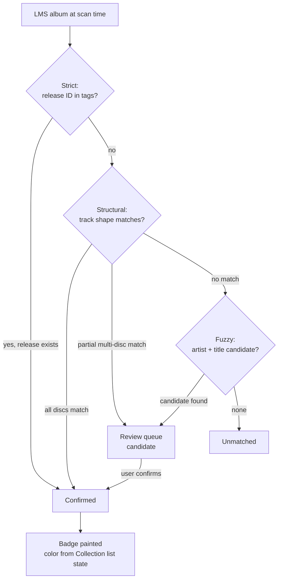
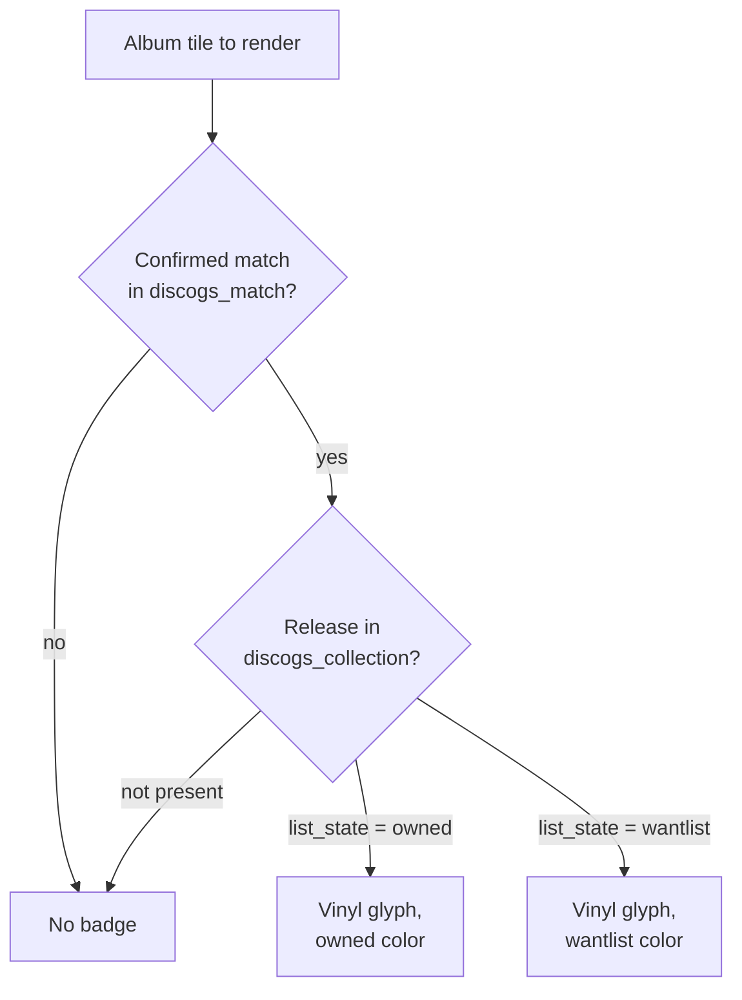
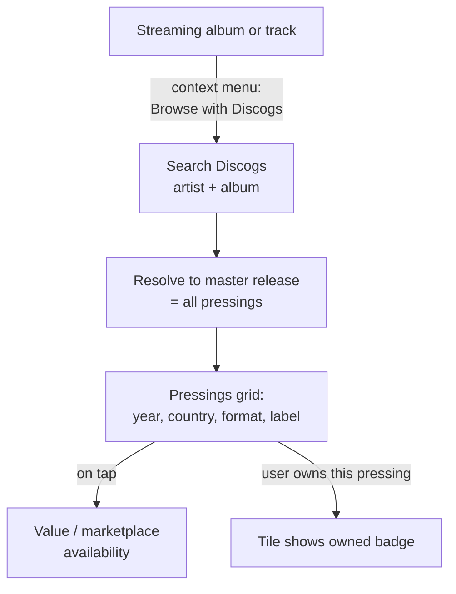
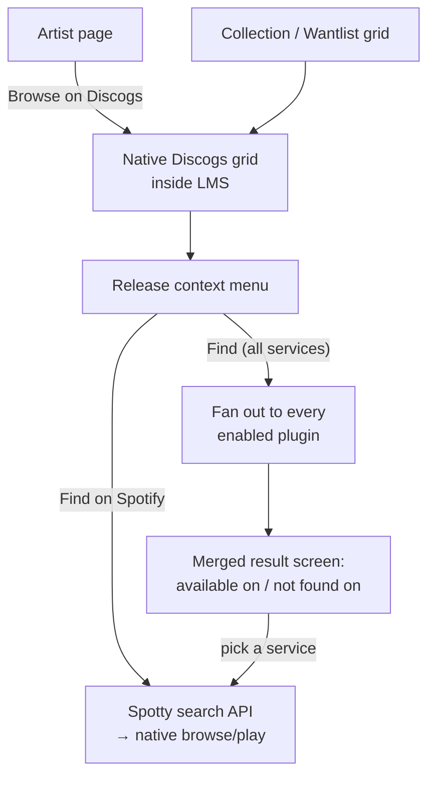

# SqueezeWax — Design Reference

Design ideas and decisions for **SqueezeWax**, a Discogs plugin for Lyrion
Music Server (LMS), collected from brainstorming sessions (August 2026).

---

## 1. Background & Research Findings

- **No Discogs plugin exists** in the official LMS plugin directory
  (https://lyrion.org/plugins/directory/) — verified against the full directory.
- Discogs data currently reaches LMS only indirectly:
  - **Music and Artist Information (MAI)** plugin (Michael Herger) uses Discogs
    as one of several sources (alongside Wikipedia, AllMusic, Last.fm) for
    artist pictures and metadata.
  - **extGUI4LMS** (alternative, now-inactive web interface, last active
    ~2016) offered basic Discogs lookup via a user-supplied API token —
    pulling release/artist metadata and cover art (including back covers)
    into its browse view. No ownership tracking, matching, or collection
    features — a good illustration of how thin prior Discogs integration
    has been, not a competing project.
- **Precedent for the badge/browse patterns exists** (verified via screenshots):
  - Streaming plugins (Spotty/Spotify, Deezer) badge album tiles in grid view
    with a service logo overlay in the artwork corner. Badging happens
    per-album-edition (two editions of the same album can differ: one badged,
    one not).
  - Artist pages include a "Browse on Spotify" menu entry alongside
    Albums / EPs / Singles / Compilations / Appearances.
  - Service source is recorded at **library scan time** via each plugin's
    `Importer.pm` (e.g. Spotty registers the `spotify:track:` URI prefix and
    imports the user's Spotify library into "My Music" during the scan).

### Reference: LMS music-service plugin structure

Typical plugin layout (per lyrion.org/reference/music-service-plugin/):

| File | Purpose |
|---|---|
| `Plugin.pm` | Entry point; initializes settings, importer, protocol handler |
| `API.pm` | Shared Discogs API code (URLs, data transforms) |
| `API/Async.pm` | Non-blocking calls (server side; LMS is single-threaded) |
| `API/Sync.pm` | Synchronous calls (scanner/importer side) |
| `Importer.pm` | Scan-time import/matching (synchronous HTTP only) |
| `Settings.pm` | Configuration pages |
| `Settings/Auth.pm` | Discogs OAuth handling |

### Naming (resolved)

- **Chosen name: SqueezeWax.**
  - Package namespace: `Plugins::SqueezeWax::` (per LMS convention — the
    package name is reused as the plugin's identifier in the repository
    listing).
  - Follows the existing community naming pattern (SqueezeCloud, SqueezeSonic)
    rather than fusing "Discogs" into the plugin's own name.
  - Optional repository display title: **"SqueezeWax for Discogs"** — see
    brand-usage restrictions below for why this suffix form, specifically, is
    the safe way to reference Discogs in the name if desired.
- **Rejected candidates:**
  - *CrateDigger* — "Crate Diggers" is itself one of Discogs' own protected
    marks (alongside NearMint, VinylHub, etc.), listed in their Application
    Name and Description Policy as **not** available for third-party use.
  - *CrateLink* — name collision with an existing, actively maintained
    product: a Serato-crate-syncing mobile app of the same name
    (cratelink.app), live on the App Store. Same domain (music-library
    tooling), real confusion risk.
  - *SqueezePress* — rejected on plain English grounds rather than
    trademark/collision grounds: "squeeze" and "press" are near-synonyms, so
    the name reads as a tautology and obscures the intended "record
    pressings" meaning.
  - *SqueezeShelf*, *SqueezeGroove*, *MyShelf*, *MyCrate* — considered,
    not chosen (author preference); SqueezeShelf and SqueezePress were the
    most format-neutral options (vinyl/CD/cassette alike) but lost out to
    SqueezeWax on preference. MyShelf/MyCrate were not collision-checked, as
    they were dropped before that step.
  - No formal trademark-registry search was performed for any candidate;
    checks were web searches for existing products/software in active use,
    which is what matters practically for a free open-source LMS plugin.

### Discogs brand-usage restrictions (verified against Discogs policy)

Source: Discogs' [Application Name and Description Policy](https://support.discogs.com/hc/en-us/articles/360009207054-Application-Name-and-Description-Policy)
(effective Dec 11, 2019). These restrictions bind **any** place the plugin's
name, description, or UI references Discogs — not just the package name —
including the badge and its context menu (§4).

**"Discogs mark" is defined broadly**: the Discogs name, the Discogs logo, or
any word/phrase/image that identifies the source of the Discogs service. This
is why the badge glyph decision in §4 (generic vinyl icon, not the Discogs
"D" logomark) is a policy requirement, not just a stylistic choice.

**Not allowed, anywhere in the plugin's name, description, or branding:**
- Combining any part of "Discogs" with the plugin's own name, marks, or
  generic terms (rules out forms like "Discogs App", "My Discogs", "Discogs
  Collector", "Catalog by Discogs" — Discogs' own listed bad examples).
- Names or logos that imitate or could be confused with Discogs' marks.
- Presenting Discogs' marks/assets as the most distinctive or prominent
  feature of anything the plugin creates or displays.
- Using any of Discogs' *other* protected marks: "NearMint," "Crate
  Diggers," "Bookogs," "Comicogs," "Filmogs," "Gearogs," "Posterogs," or
  "VinylHub."

**Allowed:**
- Accurately describing integration, e.g. "Log in with Discogs," "View your
  Discogs Collection," "Access your Discogs Wantlist" — safe wording for
  Settings/Auth screens (§9) and the badge context menu (§4).
- Referencing Discogs in the plugin's *display* name via a trailing "for
  Discogs" suffix after a unique, unrelated name — Discogs' own sanctioned
  examples are "Vinyl Catalog for Discogs" and "Collect for Discogs." This is
  the only endorsed way to put "Discogs" in the name itself.

**Practical takeaway for implementation**: keep "SqueezeWax" as the standalone
name everywhere (package, menus, repository listing); use plain descriptive
phrases ("Discogs Collection," "Discogs Wantlist," "View on Discogs") for
functional labels; never render the Discogs logo/wordmark as the badge or
anywhere the plugin's own branding would sit alongside it in a way that could
suggest partnership or endorsement.

---

## 2. Core Concept

The plugin connects a user's **physical record collection** (tracked on
Discogs) with their LMS library (local rips + streaming services), in both
directions:

1. **Ownership awareness** — see at a glance which albums in LMS you own
   physically; inspect details and value of the owned pressing.
2. **Marketplace lookup** — on demand, check availability and price range of a
   release on the Discogs marketplace.
3. **Cross-browsing** — jump from a streaming album to its physical editions on
   Discogs, and from a Discogs discography back into streaming plugins.

The plugin never plays audio itself. Discogs is treated as a music-service
plugin **for a catalog you don't stream from** — it only links out (buy,
browse, play elsewhere).

---

## 3. Matching: Linking LMS Albums to Discogs Releases

Matching runs at **library scan time** via `Importer.pm` (synchronous, like
Spotty). Each result is stored in a plugin-owned table:

```
album_key → discogs_release_id, match_tier, match_confidence, matched_at
```

`album_key` — a hash over the album's tracks' `urlmd5`, sorted — is the
match's identity, not `lms_album_id`. LMS's own `albums.id` is
`INTEGER PRIMARY KEY AUTOINCREMENT` and does not survive a `library.db`
wipe; `urlmd5` is LMS's own cross-wipe key (see §10, and
`squeezewax-v1-decisions.md` §2 for the full finding). `lms_album_id` is
still cached alongside for fast lookups, refreshed whenever a rescan
completes, but is never treated as identity.

### Three matching tiers — a cascading pipeline

The tiers run as a **cascade** per album: Strict is tried first; if it can't
apply (no release ID in tags), Structural is tried; if that finds nothing,
Fuzzy is tried. The Settings option (§8) selects the **maximum tier enabled**
(e.g. "Structural" = try Strict then Structural, never Fuzzy) — it is not a
single-mode picker.

| Tier | Signal | Behavior |
|---|---|---|
| **Strict** | Authoritative Discogs release ID already present in local file tags | Auto-confirm. No ambiguity. Ideal case for rips tagged with Discogs (user's ripped albums are largely tagged this way). |
| **Structural** | Artist + album title + **track count** + **per-track durations within a margin** (e.g. ±2–3 s, since rips trim silence differently) | Auto-confirm. Fingerprints the release by its track *shape*, same approach as the foobar2000 Discogs tagger. Strong enough to disambiguate near-identical pressings/reissues. Before fetching any candidate's tracklist, filters search results on **format, year and country** — already present in the search response, so this costs nothing — a CD rip never pulls vinyl-pressing data. This is what keeps Structural's request cost bounded; see §13 for the exact budget. |
| **Fuzzy** | Artist + title only (optionally year tolerance) | Never auto-confirms. Goes to a **review queue** as a "candidate match". Needed for streaming tracks (Spotify etc.) where no local file/tags exist. |

### Matching pipeline (flowchart)



**Example walkthroughs:**

1. *Strict:* A rip of *Kind of Blue* carries a Discogs release ID in its file
   tags (written by the tagger at rip time). The scanner looks up that ID
   directly → **Confirmed** without any search. This is the expected path for
   most of the user's ripped library.
2. *Structural:* An untagged-by-ID rip of a 1994 CD reissue: artist + title
   search yields six pressings; only one has the same 12 tracks with all
   durations within ±3 s → **Confirmed** automatically, and it identified the
   *specific pressing*, not just the album.
3. *Partial multi-disc:* A 2-CD deluxe edition where disc 1 matches perfectly
   but disc 2 (bonus disc) has an extra track → **not** auto-confirmed; lands
   in the **review queue** for the user to resolve (maybe they own the
   standard edition, maybe Discogs' tracklist differs).
4. *Fuzzy:* A Spotify album (no local files, no durations to fingerprint
   reliably against a pressing): artist + title search finds a master release
   → **candidate** in the review queue; the user picks the pressing they own,
   promoting it to Confirmed.

### Match states per album

1. **Unmatched** — no link attempted or no candidate found.
2. **Candidate** — match awaiting user confirmation (review queue).
3. **Confirmed** — the album is linked to a specific Discogs release.

**Note:** the match state records only *that* a link exists and how sure we
are of it. Whether the badge paints as "owned" or "wantlist" (and its color)
is **derived at render time** by joining the confirmed release against
`discogs_collection.list_state` (§9) — ownership is a property of the user's
Collection, not of the match itself. (An earlier draft called the state
"confirmed owned"; that conflated the two.)

### Confirmation & feedback loops

- The review queue offers search-as-you-type against Discogs to manually link
  an album to a specific pressing; confirming promotes candidate → confirmed.
- A successful manual "Find on Spotify" (see §6) can retroactively backfill /
  upgrade the confidence of the original scan-time match.

### Multi-disc releases & box sets (resolved)

- **Decision: strict per-release matching — all discs must match.**
  A multi-disc release/box set is only promoted to Structural-tier
  confirmation if **every disc** in the set matches (track count +
  per-track duration margin) against the corresponding LMS discs. A partial
  match (e.g. disc 1 of 2 matches, disc 2 doesn't) does **not** auto-confirm —
  it falls back to the review queue as a candidate, same as a Fuzzy-tier
  match, so the user can resolve the discrepancy manually.

### Re-match triggers

An album is (re-)matched when:

- it is **new** at scan time (no `discogs_match` row);
- its **tags changed** since the last scan (detected via LMS's own
  changed-file handling during rescan) — the old match row is invalidated and
  the cascade runs again;
- the user triggers a **manual "re-match"** action from the album's Discogs
  context menu (e.g. after fixing tags or learning the auto-match picked the
  wrong pressing);
- a full **"clear & rebuild matches"** maintenance action in Settings wipes
  the match table and re-runs the cascade for the whole library.

Confirmed matches are otherwise **stable across rescans** — a routine rescan
does not re-run searches for already-confirmed albums (this is what keeps
rescans cheap under the rate limit).

### Constraints

- Discogs API rate limit: **60 requests/min (authenticated)**. Large-library
  scans must be batched/throttled; results cached in a local SQLite table so
  re-scans are cheap.
- Matching a Discogs *pressing* to LMS tracks is inherently ambiguous when only
  generic tags exist — hence the tier system rather than one algorithm.

---

## 4. Badge (Ownership Indicator)

- **Where**: corner overlay on album artwork, in
  - grid view while browsing, and
  - the Now Playing screen (smaller).
- **Which corner**: the Discogs badge sits in the artwork corner **opposite**
  the streaming-service badge (e.g. if Spotify/Deezer badge the
  bottom-right/top-right corner, Discogs occupies the left-side corner) —
  the two can coexist on the same tile without overlapping.
- **When**: for albums in **confirmed** match state whose linked release is in
  the user's Collection (owned) or — optionally — Wantlist (§9 derivation).
- **What**: a **vinyl-record glyph** (not the Discogs "D" logomark) — kept
  generic/iconographic rather than using Discogs' own brand mark, to sidestep
  branding-guideline questions the way the marketplace-linkout approach
  already does. **This is a policy requirement, not just a style choice**:
  Discogs' Application Name and Description Policy defines "Our Discogs mark"
  to include the Discogs logo and any image/designation identifying their
  service, and prohibits presenting their marks as the most prominent
  feature of what a third-party app creates (see §1, naming section). A
  badge rendered as the Discogs "D" logomark on every owned album tile would
  sit squarely inside that restriction; the generic vinyl glyph does not.
- **Rendering is skin-independent by design**: the intent is a single overlay
  mechanism that works the same way regardless of skin (default web UI,
  Material Skin, etc.), rather than a per-skin reimplementation. This still
  needs to be verified once implementation starts — no confirmed generic
  badge/overlay API was found in LMS core (see "Rendering note" below), so
  whether true skin-independence is achievable, or whether each skin needs
  its own CSS/template hook, is something to validate against actual skin
  source rather than assume.
- **Granularity**: per album *edition* (matching the observed Spotify
  behavior — two editions of the same album can be badged independently).
- **Artist-level badge**: opt-in via Settings, and scoped **only to artists
  present in the user's Discogs Collection** (i.e. "I own physical releases
  by this artist") — not the Wantlist. Off by default to avoid the extra API
  calls unless the user opts in.

### Owned vs. Wantlist — visual distinction (resolved)

- **Same vinyl glyph for both states, distinguished by color.**
- Both the "owned" color and the "wantlist" color are **user-configurable in
  Settings** (see §8), rather than fixed.

### Badge-state derivation (flowchart)



**Example walkthrough:** Grid view renders a tile for *Blue Train*. The match
table says it's confirmed against release 123456. The collection cache says
release 123456 has `list_state = owned` → the tile gets the vinyl glyph in
the user's configured "owned" color, in the corner opposite the Spotify
badge. A second edition of the same album (different LMS album entry, matched
to a different pressing that's on the Wantlist) renders the same glyph in the
wantlist color — two tiles, same album title, different badge colors, exactly
the per-edition behavior observed with Spotify badging.

### Rendering note

No evidence found that LMS core provides a generic badge/overlay mechanism —
the Spotify badge appears to be plugin/skin-drawn. The Discogs plugin will
draw its own overlay via template/CSS hooks for the default web UI. Given the
skin-independence goal above, this should be re-examined during
implementation to confirm the same hook/approach genuinely applies across
skins (e.g. Material Skin) rather than requiring a distinct integration path.

### Licensing caveat

Spotify's branding guidelines prohibit placing logos/overlays **on artwork
provided by Spotify**. Locally scanned/ripped artwork is unaffected. If the
badge would sit on Spotify-sourced art, this is a gray area to keep in mind.

### Badge context menu ("Discogs" entry)

Tapping the badge / choosing the Discogs context-menu entry on an owned album
reveals details of the **owned variant**:

- Pressing details: format (vinyl/CD/cassette), catalog #, label, country, year
- Credits (musicians, producers, engineers — a Discogs strength)
- Collection data: date added/acquired, condition/grading if tracked
- Current estimated value (fetched on demand)
- "View on Discogs" link-out
- **"Re-match…"** — manual re-match action (§3, re-match triggers)

All Discogs-referencing labels here ("View on Discogs," etc.) use the
descriptive phrasing pattern permitted under Discogs' brand-usage policy
(§1) — plain factual references to the integration, not stylized use of
their mark.

---

## 5. Collection Value & Statistics

Requires Discogs **OAuth** (`Settings/Auth.pm`); pulls the user's Collection
(and optionally Wantlist) into a local cache via a slow background sync job
(rate-limit-aware).

### Features

- **Total estimated collection value** — sum of Discogs' suggested prices,
  shown as a low/median/high range (Discogs provides a spread, not one number).
- **Value trend over time** — Discogs' API provides no historical prices, so
  the plugin snapshots prices periodically and builds its own history table
  (chartable).
- **Stat cuts**: value by genre, decade, label; most valuable items;
  "sleepers" (largest appreciation since added).
- **Cross-reference with LMS library**:
  - records owned but never ripped/scanned into LMS ("not playable"),
  - digital-only albums with no physical counterpart,
  - a "collection completeness" view (how much of the physical collection is
    playable through LMS).

### Currency normalization (resolved)

- **Default display: Discogs' own native/listed currency per marketplace
  entry** — no forced conversion or aggregation by default.
- **Settings option to recalculate into another display currency** on demand
  (see §8) for users who want a single normalized total. The conversion rate
  source itself still needs to be chosen/verified against an actual FX-rate
  API during implementation, rather than assumed here.

### Caveats

- Prices are per-marketplace and per-currency; aggregation needs normalization.
- Community-edited data quality varies (strongest for vinyl/electronic niches).

---

## 6. Cross-Browsing (Two Inverse Flows)

### Flow 1: Streaming → Discogs — "what physical editions exist?"

- **Trigger**: context menu on any streaming album/track → **"Browse with
  Discogs"**.
- **Resolution**: search Discogs by artist+album and resolve to the **release
  group** (master release = all pressings), not one pressing.
- **Result**: grid/list of pressings — year, country, format, label — with
  value / marketplace availability inline or on tap.
- Read-only and ownership-independent; but if the user **owns** one of the
  listed pressings, that tile shows the owned badge (shared visual language
  with §4).



**Example walkthrough:** *I listen to Spotify. I hear a nice song. I browse
to the album. I want to know what physical releases exist.* From the album's
context menu I choose **Browse with Discogs**. The plugin searches Discogs
for artist + album, resolves to the master release, and shows a grid of all
pressings — the 1971 UK first press, the 1994 CD reissue, the 2019 180g
repress — each with year, country, format, and label. Tapping one shows its
value and marketplace availability. If one of the listed pressings happens to
be in my Collection, that tile carries the owned badge.

### Flow 2: Discogs → Streaming — "where can I listen to this?"

- **Trigger A — artist page**: a **"Browse on Discogs"** entry in the artist
  menu (same slot as "Browse on Spotify"). **Resolved: opens a native grid of
  the artist's Discogs releases inside LMS** (the richer option), rather than
  linking out to a browser.
- **Trigger B — native Discogs grid**: browsing the user's Collection,
  Wantlist, or an artist discography as a Discogs-sourced grid inside LMS.
- **Context menu per release/track**:
  - **"Find on Spotify" / "Find on YouTube" / "Find on Qobuz" …** — targeted;
    calls that one plugin's search API with artist+title and hands off to its
    native browse/play flow.
  - **"Find"** (unqualified) — fans out to **all enabled** streaming/service
    plugins at once and shows a merged result screen
    ("Available on: Spotify, YouTube — not found on: Qobuz").
- **Decision**: "Find" shows a merged screen rather than auto-jumping to the
  first hit — per-service matches can be ambiguous too (the matching problem
  recurs on the way out).
- Depends on target plugins exposing searchable APIs (Spotty etc. likely do,
  since LMS global search already spans services).



**Example walkthrough:** *Same starting point as Flow 1, but now I want to
know which releases come from this artist.* From the artist page I choose
**Browse on Discogs** and get the artist's full Discogs discography as a
native grid inside LMS. I spot an interesting album I've never heard. From
its context menu I choose **Find on Spotify** — the plugin calls Spotty's
search with artist + title and hands off to Spotify's native browse/play
screen. Or I choose the plain **Find**, and the plugin queries all enabled
services at once, showing "Available on: Spotify, YouTube — not found on:
Qobuz" so I can pick where to listen (no auto-jump, since per-service matches
can be ambiguous too).

### Wantlist integration (resolved)

- **Scope: badge only** (see §4) — Wantlist items are visually flagged
  wherever the badge appears (grid view, Now Playing, cross-browse results),
  distinguished from owned items by color.
- No marketplace-result hint (e.g. "you want this" annotation inside the
  on-demand marketplace lookup screen, §7) for now — out of scope unless
  revisited later.

---

## 7. Marketplace Lookup (On Demand Only)

Explicitly **not** automatic/ambient — fires only when the user triggers it.

- **Trigger**: context menu action, e.g. **"Check availability"**, on any
  release (owned or not, local or streaming or Discogs-grid).
- **Result**: compact summary line — e.g. "14 copies available, $8–$45" —
  expandable into the full filtered listing, each entry linking out to the
  Discogs listing. No in-plugin checkout; link-out only.
- **User-filterable / sortable** (see Settings, §8): format, condition, seller
  rating, sort order, ship-to country.
- Because it is on-demand, rate-limit pressure is low; results can still be
  cached briefly per release.

---

## 8. Failure & Degradation Behavior

The plugin must stay usable (and quiet) when Discogs is slow, rate-limited,
or unreachable:

- **Badges** render entirely from the **local cache** (match table +
  collection cache) — no network calls at render time, so badges never
  disappear or stall the UI when Discogs is down.
- **Marketplace lookup / value fetch** (on-demand actions) fail gracefully
  with a short message ("Discogs not reachable — try again later") and never
  block navigation.
- **Collection/Wantlist sync** and **price snapshots** are background jobs:
  on failure they log, back off, and retry at the next scheduled interval —
  no user-facing errors, stale data simply persists until the next
  successful sync.
- **Scan-time matching**: if the rate limit or a network failure interrupts a
  scan, matching is **resumable** — already-matched albums are skipped
  (cached), and unprocessed albums are picked up by the next scan or a manual
  "continue matching" action. A partial scan must never corrupt or discard
  existing confirmed matches.
- **OAuth token expiry/revocation**: collection-dependent features degrade to
  cached data and Settings shows a "re-authenticate" prompt; matching and
  read-only browsing (which work with app-level auth) continue.

---

## 9. Settings (`Settings.pm`)

### Authentication
- Discogs OAuth (required for Collection/Wantlist features; token storage).

### Matching
- Maximum matching tier enabled: **Strict / Structural / Fuzzy** — the
  cascade always starts at Strict and stops at the selected tier (see §3).
- Duration margin for structural matching (default ±2–3 s).
- Multi-disc releases require **all discs** to match for auto-confirmation
  (no separate setting — this is the fixed behavior; partial matches always
  fall to the review queue).
- Review-queue behavior (auto-open after scan? notification?).
- Maintenance: **"clear & rebuild matches"** action (§3, re-match triggers).

### Badge
- Enable/disable badge in grid view.
- Enable/disable badge on Now Playing.
- Optional artist-level badge (Collection artists only).
- Enable/disable Wantlist badge.
- **Badge color for "owned"** (configurable).
- **Badge color for "wantlist"** (configurable).

### Marketplace preferences
- Format filter: vinyl only / CD only / any.
- Minimum media condition (Goldmine grading: M, NM, VG+, VG, …).
- Minimum seller rating (%).
- Sort order: price ascending / seller rating / condition / newest listing.
- Ship-to country filter.
- What to show and **in what order** in the result summary
  (e.g. amount available first, then price range).

### Collection / value
- Sync interval for Collection/Wantlist.
- Price-snapshot interval (for the value-history chart).
- **Display currency**: default = Discogs' native currency per item; optional
  override to recalculate a normalized total into a chosen display currency.

---

## 10. Data Model (Sketch)

```
discogs_match
  lms_album_id        (FK to LMS album)
  discogs_release_id
  discogs_master_id
  match_tier          (strict | structural | fuzzy)
  state               (candidate | confirmed)
  matched_at

discogs_collection
  instance_id         (PK — Discogs collection instance; the same release
                       can be owned in multiple copies, each its own instance)
  discogs_release_id
  format, catalog_no, label, country, year
  condition, added_at, notes
  list_state          (owned | wantlist)

discogs_price_snapshot
  discogs_release_id
  snapshot_at
  price_low, price_median, price_high, currency
```

**Badge derivation** (see §4 flowchart): badge presence and color are computed
by joining `discogs_match` (state = confirmed) with `discogs_collection` on
`discogs_release_id` and reading `list_state`. Ownership is never stored in
the match table.

---

## 11. v1 Scope & Roadmap

**v1 (core value, smallest surface):**
- Strict + Structural matching, review queue, manual re-match.
- Owned badge (grid + Now Playing) with badge context menu (pressing details,
  credits, on-demand value, Discogs link-out).
- OAuth + Collection sync (needed for the owned badge).
- On-demand marketplace lookup.

**v2:**
- Fuzzy tier (streaming-album matching) + Wantlist sync & wantlist badge.
- Flow 1 (streaming → Discogs pressings grid).
- Collection value total + price snapshots.

**v3:**
- Flow 2 (native Discogs grids, "Find on …" / "Find" fan-out).
- Statistics dashboard (value trend chart, stat cuts, completeness view).
- Artist-level badge (opt-in), currency conversion option.

---

## 12. Open Questions / Follow-ups

All original open design questions have been resolved (see §3–§9 for the
decisions and where they now live). Remaining follow-ups to verify during
implementation, rather than open design questions:

- Confirm whether a genuinely skin-independent badge/overlay mechanism is
  achievable in LMS core, or whether Material Skin (and others) will still
  need a distinct integration path — check against actual skin source rather
  than assuming.
- Choose and verify an actual FX-rate source for the optional currency
  conversion feature (§5/§9) — not yet selected.
- Multi-disc matching (§3) is defined for standard multi-CD/LP releases;
  edge cases (e.g. bonus-disc-only mismatches, box sets with non-audio discs)
  should be validated against real Discogs release data once implementation
  starts.
- Verify how LMS's rescan flags changed files, to hook the tag-change
  re-match trigger (§3) into the scanner correctly.

---

## 13. Key Technical Constraints (Summary)

- **Discogs API**: 60 req/min authenticated; OAuth for user data; no
  historical price endpoint (snapshot locally). **Scan-time budget:** at
  ~1–2 search requests per album, a cold match of a 2,000-album library is
  bounded below by roughly **35–70 minutes** of pure API time — matching must
  therefore be incremental, resumable (§8), and cached so it only ever runs
  cold once.
- **LMS**: single-threaded — server-side calls must be async
  (`Slim::Networking::SimpleAsyncHTTP`), scanner-side calls synchronous
  (`Slim::Networking::SimpleSyncHTTP`); Perl plugin architecture per the
  official music-service-plugin reference.
- **Spotify branding**: no overlays on Spotify-provided artwork.
