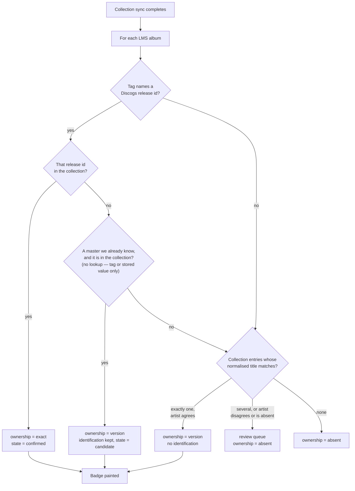
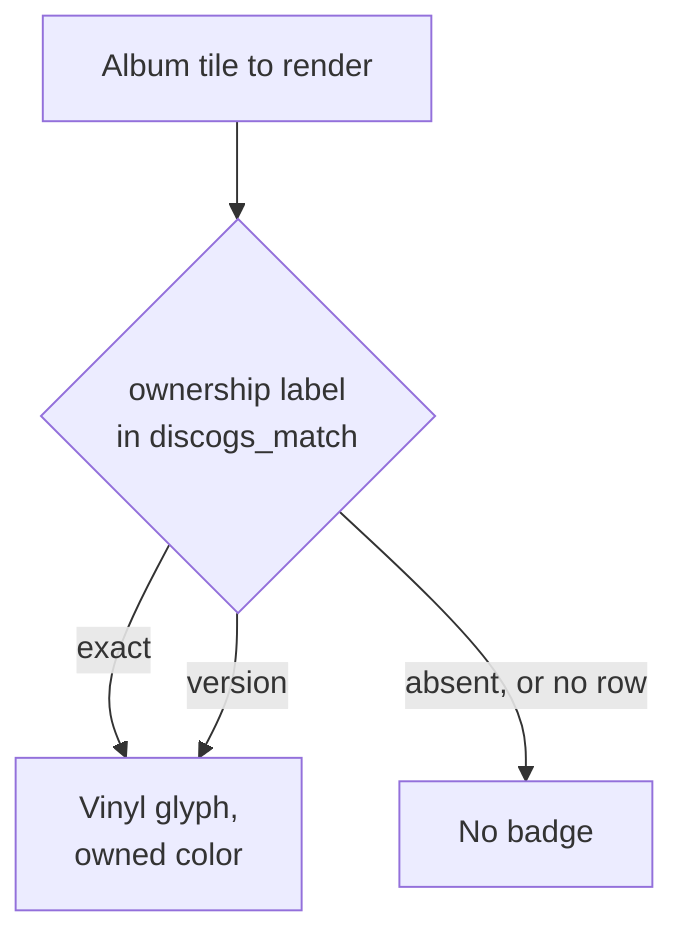

# Design-reconciliation replacement text

**Drafted 2026-09-13 (design chat).** The replacement text for all ten sections
of `docs/squeezewax-design.md` touched by the reconciliation, in the order
`plans/design-reconciliation-plan.md` step 5 applies them.

Committed as scaffolding, like the survey. It exists so the drafted text is
diffable against what actually lands, and so it is not lost if the edit session
fails partway. It has no authority once the rewrite is in: **design is the live
spec, this is a record of what was proposed.**

Corrections taken during drafting are folded in here rather than left as
amendments — the §3 node F fix and the §4 Edit 5 rewrite are already applied
below. Reasoning for every choice is in `docs/squeezewax-v1-decisions.md` §14
and in `TODO.md`; it is not repeated.

**Every section's marker is removed by the same edit that rewrites the section.
The banner comes out last, alone.** Eleven markers, inventory in the plan.

Section references name their document, per `docs/working-agreement.md` §2.

---

## §10 — Data Model (Sketch)

Replaces the section in full, including its marker.

````
## 10. Data Model (Sketch)

```
discogs_match
  album_key           (PK — hash over the album's tracks' urlmd5, sorted;
                       identity of the match, not lms_album_id — see §3)
  mb_album_id         (albums.musicbrainz_id where present, secondary
                       resolution path)
  lms_album_id        (denormalised cache column, refreshed whenever a
                       rescan completes; never trusted as identity)
  discogs_release_id  (which release this album IS. Identity, never
                       ownership. NULL for a conflict row or an
                       edition-level match — see §3 and
                       squeezewax-v1-decisions.md §3a)
  discogs_master_id   (which edition. From a tag, or from the collection
                       entry's master_id)
  ownership           (exact | version | absent — what the user OWNS.
                       Written by the collection sync; never NULL, since
                       "absent" is an answer rather than a missing one)
  match_tier          (strict | manual, or NULL — provenance of the
                       identification. NULL where there is none)
  state               (candidate | confirmed, or NULL — as match_tier,
                       NULL where no identification was made. No default:
                       an omitted state must not silently become
                       "candidate")
  matched_at
  source_timestamp    (MAX(tracks.timestamp) over the album's local tracks at
                       match time; the skip key for a rescan. NULL forces
                       re-examination, which is how a settings change
                       invalidates the cached answer — decisions §3b)
  -- orphan-recovery snapshot, captured at confirm time:
  snapshot_artist
  snapshot_album_title
  snapshot_track_count
  snapshot_total_duration

discogs_no_match
  album_key           \  PK — "this tier was attempted for this album at this
  tier                /       source state and produced no candidate"
  source_timestamp    (as above; NULL never compares equal, so it never skips)
  checked_at

discogs_release_cache
  discogs_release_id  (PK)
  discogs_master_id
  payload             (cached release payload: tracklist, format, year,
                       country. Not written in v1; retention is constrained
                       by the Discogs API Terms of Use, not by usefulness —
                       see squeezewax-v1-decisions.md §9.5)
  fetched_at

discogs_price_snapshot
  discogs_release_id
  snapshot_at
  price_low, price_median, price_high, currency
```

`album_key` replaces `lms_album_id` as the match table's identity because
`albums.id` (`INTEGER PRIMARY KEY AUTOINCREMENT`) does not survive a
`library.db` wipe, while `urlmd5` does — see §3 and
`squeezewax-v1-decisions.md` §2 for the full finding, including the
orphan-recovery flow the snapshot columns above support.

**Identification and ownership are separate columns, and neither substitutes
for the other.** `discogs_release_id` answers *which release this album is*;
`ownership` answers *what the user owns*. The case that forces the split is the
common one: a file tagged `DISCOGS_RELEASE_ID=123` while the collection holds
release 456, both under the same master. The user owns a version, not that
pressing. Expressing ownership by NULLing the release id would destroy an
identification the user supplied themselves. Reasoning in
`squeezewax-v1-decisions.md` §13.3.

**`match_tier` is NULL for an album identified by nothing.** The column records
the provenance of an *identification* — a tag, or the user. A collection match
makes no identification: it establishes that the user owns a record with this
title by this artist, and never says which pressing. There is no provenance to
record, so the column is empty rather than carrying an invented value. `strict`
and `manual` are the only values written; `structural` and `fuzzy` are gone with
the tier that produced them. Reasoning in `squeezewax-v1-decisions.md` §14.1,
which also records why this makes the migration a table rebuild rather than an
added column.

`state` is NULL for the same reason and in the same rows. The two columns are
always empty together: they describe an identification, and either there is one
or there is not. It follows that **a row must be worth its existence** — absence
of a row already means "nothing known", so a row identifying nothing and owning
nothing asserts nothing and is never written. A row exists where there is an
identification, or an ownership conclusion other than `absent`
(`squeezewax-v1-decisions.md` §14.8).

**v1 stores no Discogs Content.** There is no collection table. The sync holds
each page of the user's collection in memory, matches it against LMS albums
there, writes the conclusion into `ownership`, and discards the payload
(`squeezewax-v1-decisions.md` §13.2, applying §9.5's "store conclusions, not
Content"). One consequence is a requirement rather than a note: **matching must
be deterministic**, because the payload is gone and a re-sync re-derives every
conclusion from scratch. The same collection against the same library must
produce the same answers, or badges change between syncs with no visible cause.

**The `snapshot_*` columns are LMS-side and stay.** `snapshot_artist` and
`snapshot_album_title` hold the *local* album's identity for orphan recovery
(`squeezewax-v1-decisions.md` §2), not Discogs' copy of it. They are the one
place in the schema where stored text could be mistaken for Discogs Content and
is not.

**`discogs_no_match` is entirely regenerable**, unlike `discogs_match`. It
exists so a rescan does not re-read one or two files for every unmatched album
forever — LMS reads no audio files at all on a no-change rescan, so without it
we would be adding a cost where there is none. Dropping it costs re-reads, never
a match. Two rules follow, both in decisions §2a: **orphan recovery must never
read it** (it answers "which local album does this existing match belong to",
and a no-match row is not a match), and the "clear & rebuild matches" action
(§9) must clear it.

**Badge derivation** (see §4): the badge reads the `ownership` column directly.
There is no join and no render-time test — the sync has already decided, and a
badge paints for `exact` or `version` alike. Confirmation is not required: an
unambiguous title-and-artist match against the collection badges version
ownership with no tag, no confirmed state and no local file
(`squeezewax-v1-decisions.md` §13.10.2 and §13.10.3). Request cost is in §13,
which budgets the sync rather than the render.
````

**Removed:** the `discogs_collection` table and its regenerability paragraph;
"a collection re-sync of roughly 20 requests (§4)"; the dual ownership test; two
inline strikethrough corrections (release-cache caching, badge-derivation join).

---

## §3 — Matching: Linking LMS Albums to Discogs Releases

Replaces the section from its heading to the end of "Re-match triggers",
including **both** markers. The closing "Constraints" block is **retained
verbatim** — see `TODO.md` finding Z.

**Two headings change, and nothing else about the section's structure does:**

| Current | Becomes | Why |
|---|---|---|
| `### Three matching tiers — a cascading pipeline` | `### Two routes, and they conclude different things` | There is no cascade and there are not three tiers (`squeezewax-v1-decisions.md` §13.8) |
| `### Multi-disc releases & box sets (resolved)` | `### Multi-disc releases & box sets` | "(resolved)" referred to the duration-vector rule, which §13.8 removed; nothing is resolved because nothing is asked |

The remaining headings — `### Matching pipeline (flowchart)`,
`### Match states per album`, `### Confirmation & feedback loops`,
`### Re-match triggers` and `### Constraints` — keep their exact current text.
The walkthroughs have no heading and gain none.

````
## 3. Matching: Linking LMS Albums to Discogs Releases

Matching answers two questions that are not the same question, in two passes
that run at different times.

**Identification** — *which Discogs release is this album?* Runs at library scan
time, per album, inside `Importer.pm`, from the album's own file tags. It skips
an album whose files have not changed since the last attempt, keyed on
`source_timestamp` (§10).

**Ownership** — *does the user own this record?* Runs as a separate pass,
triggered by a completed collection sync rather than by a scan. It **does not**
use the file-state skip: buying a record changes nothing on disk, so an album
whose files are untouched is exactly the album whose ownership may have changed.
A rescan alone never recovers a badge; a sync does. The sync's own triggers are
in §9.

The two passes write into one row, and the conclusion is the tuple

`album_key → discogs_release_id, discogs_master_id, ownership, match_tier,
state, matched_at`

with the ownership label and the identification kept in separate columns because
they answer separate questions. See §10 for the columns and
`squeezewax-v1-decisions.md` §13.3 for why conflating them fails.

[RETAINED VERBATIM — the `album_key` identity paragraph. Do not re-type it.]

### Two routes, and they conclude different things

The v1 flow is collection-first: the user's own Discogs collection is synced,
and LMS albums are matched against it. There is no per-album search of the
Discogs database. Reasoning, and the measurement that produced it, in
`squeezewax-v1-decisions.md` §13.1 and §13.10.

| Route | What it reads | What it concludes |
|---|---|---|
| **Strict** | A configured tag on the album's files naming a Discogs release id | An **identification**. Ownership only if that same id, or its master, is in the collection |
| **Collection** | The synced collection, by title then artist | An **ownership** conclusion. Never an identification — it does not say which pressing |

Neither route searches Discogs, and neither reads track durations. Structural
and Fuzzy matching are gone: both were narrowings of a whole-database search
that no longer runs (`squeezewax-v1-decisions.md` §13.8).

**Every album is in scope**, including albums with no local files at all. The
old `local_tracks == 0` gate came from duration fingerprinting, which needed
files to read durations from; a title comparison needs none. On the reference
library the gate excluded 186 of 765 albums, and removing it matched 10
additional owned records (`squeezewax-v1-decisions.md` §13.10.1).

**Title comparison normalises no further than case-folding and whitespace
collapse.** Both sides are decoded to character strings first; then leading and
trailing whitespace is trimmed and internal runs collapsed to one space; then
case is folded. Punctuation-stripping, article-stripping and bracket-suffix
removal are **not** used — measured, punctuation-stripping gained one album and
produced one wrong badge, which is a bad trade at 1:1
(`squeezewax-v1-decisions.md` §13.10.4).

**Artist gates every auto-badge and is not a tiebreak.** An ownership conclusion
from the collection route requires exactly one collection entry agreeing on both
title *and* artist. Several candidates, artist disagreeing, or artist absent on
either side: the album goes to the review queue instead of badging
(`squeezewax-v1-decisions.md` §13.10.3).

### Matching pipeline (flowchart)



The tests are ordered, and the order is the point: a tag the user supplied
themselves outranks a title comparison. An album that reaches **H** carrying a
tag keeps its identification — `discogs_release_id` and `match_tier = 'strict'`
stay as they are, and only `ownership` is written by the collection route.

**No step in this flow makes a Discogs request.** Identification reads tags from
files the scanner is already opening; ownership reads the collection the sync
has already fetched. Node **F** uses a master id only where one is already known
— from a configured master tag, or stored on the row from an earlier match — and
never looks one up, because a per-album lookup is the cost
`squeezewax-v1-decisions.md` §13.1 removed.

**A badge does not require a confirmed state, a tag, or a local file.** Path
**I** is the common one: 87 of 96 matches on the measured page auto-badged, most
of them by this route (`squeezewax-v1-decisions.md` §13.10.2, §13.10.4).

**K writes no row.** Absence of a row already means "nothing known", so an album
identifying nothing and owning nothing is not recorded
(`squeezewax-v1-decisions.md` §14.8).

**The pass must be deterministic.** The collection payload is discarded after
the sync (§10), so a re-sync re-derives every conclusion from scratch. The same
collection against the same library must reach the same answers, or badges
change between syncs with no visible cause.

1. *Tagged, and owned.* A ripped CD tagged `DISCOGS_RELEASE_ID=1234567`. The
   scanner reads the tag; the sync finds 1234567 in the collection →
   **ownership `exact`, state `confirmed`**, badge painted. The expected path
   for a well-tagged rip of a record the user owns.

2. *Tagged, and owned in a different pressing.* The tag names release 123; the
   collection holds release 456, a different pressing of the same master. The
   user owns the record, not that pressing → **ownership `version`**, with the
   identification left alone: `discogs_release_id` stays 123, `match_tier`
   stays `strict`, state stays `candidate`. Badge painted. NULLing the release
   id here would destroy an identification the user supplied
   (`squeezewax-v1-decisions.md` §13.3).

3. *No tag, no local files, and owned.* A streaming-only album. Exactly one
   collection entry agrees on normalised title and on artist → **ownership
   `version`, no identification at all**: NULL release id, NULL `match_tier`,
   NULL state. Badge painted. This whole population was excluded from matching
   before `squeezewax-v1-decisions.md` §13.10.1 removed the `local_tracks == 0`
   gate — 186 of 765 albums on the reference library, of which 10 turned out to
   be owned.

4. *One record, two albums.* A rip and a stream of the same record are two LMS
   albums matching one collection entry. **Both badge.** This is the expected
   shape, not a collision to resolve — measured 9 of 10 cases in that direction
   (`squeezewax-v1-decisions.md` §13.10.3). The ambiguous direction is the other
   one: one LMS album matching several collection entries, measured once in 765,
   which goes to the queue.

5. *Title agrees, artist does not.* A collection entry and an LMS album share a
   title, but the artists disagree or one side has no artist at all. **No badge
   — review queue.** Measured 8 of 96 matches. Artist gates every auto-badge
   rather than only breaking ties (`squeezewax-v1-decisions.md` §13.10.3).

   The stricter behaviour is deliberate. *Substrata* and *Substrata²* are
   different Biosphere records, and artist cannot separate them; the
   normalisation rung was chosen so that they do not share a key and the second
   simply does not match. A missing badge is preferred to a wrong one
   (`squeezewax-v1-decisions.md` §13.10.4).

### Match states per album

`state` describes the **identification** only. Ownership is a separate column
and is not encoded here (§10).

1. **Unmatched** — no identification was made. Either there is no row at all,
   or there is a row carrying only an ownership conclusion, with NULL `state`,
   NULL `match_tier` and NULL `discogs_release_id`. Walkthrough 3 is the second
   form (`squeezewax-v1-decisions.md` §14.8).
2. **Candidate** — an identification exists that the collection has not
   corroborated. Reached by every tagged album whose release id is not in the
   collection, which is most of a library. Two Strict variants remain,
   distinguished by `discogs_release_id`: NULL means "we examined this and could
   not decide" — a tag conflict — and non-NULL means "we propose this". The
   second arises when a conflict demotes a previously confirmed row: the
   adjudicated id is kept, because a decision survives
   (`squeezewax-v1-decisions.md` §2a), while the demotion stops the badge
   immediately.
3. **Confirmed** — the tagged release id is present in the collection, or the
   user linked the album by hand (`squeezewax-v1-decisions.md` §13.4).

**`candidate` does not mean "in the review queue".** Most candidates are simply
albums the user does not own, and nothing needs deciding about them. The queue's
contents are enumerated in `squeezewax-v1-decisions.md` §13.10.5 and are a much
smaller set. Anything selecting queue items on `state = 'candidate'` is wrong.

**Badge derivation** (see §4): the badge reads the `ownership` column. There is
no join and no render-time test — the ownership pass has already decided, and a
badge paints for `exact` and `version` alike. Confirmation is not required.

### Confirmation & feedback loops

- The review queue offers search-as-you-type against Discogs to link an album to
  a specific pressing by hand; confirming writes `match_tier = 'manual'` and
  `state = 'confirmed'`. A manual link is the user's own decision and is not
  subject to the collection cross-check that governs Strict.
- **The queue must also offer reject / dismiss, not only confirm.** One state
  the importer can create is otherwise terminal: a confirmed match demoted to
  candidate by a tag conflict keeps its adjudicated `discogs_release_id` and its
  snapshots (`squeezewax-v1-decisions.md` §3a), and if the user then removes the
  tags altogether the importer may not delete it — the row carries a decision,
  and §2a forbids that. Nothing else will clear it, so with a confirm-only queue
  the album would propose a release with no tag behind it forever. A human has
  to be able to say no.
- **A wrongly auto-badged album has no recovery path in v1.** Ownership `version`
  is written without a confirmation step, so such an album never reaches the
  queue and there is nothing to reject. v1 assumes a well-tagged library and a
  maintained Discogs collection; the fix is to correct the collection or the
  tags. Measured zero wrong badges at the chosen normalisation rung
  (`squeezewax-v1-decisions.md` §14.4, §13.10.4).
- A successful manual "Find on Spotify" (see §6) can retroactively backfill /
  promote the original scan-time match.

### Multi-disc releases & box sets

No special rule. A multi-disc release or box set is matched by title and artist
like any other album, and its ownership is a collection fact rather than a
property of its discs.

The former rule — a box set confirmed only if every disc matched on track count
and per-track duration — belonged to Structural matching, which no longer exists
(`squeezewax-v1-decisions.md` §13.4, §13.8). Whether duration comparison returns
later as a *ranker* among candidates, rather than as a verdict, is open and is
not v1 (`squeezewax-v1-decisions.md` §13.8).

### Re-match triggers

The two passes are triggered separately, and the difference matters.

**Identification** re-runs when:

- the album is **new** at scan time (no `discogs_match` row);
- its **tags changed** since the last scan, detected via LMS's own changed-file
  handling during rescan — the old identification is invalidated and Strict runs
  again;
- the user triggers a **manual "re-match"** from the album's Discogs context
  menu;
- a **"clear & rebuild matches"** maintenance action in §9 wipes the match table
  and re-runs from scratch.

Confirmed identifications are otherwise **stable across rescans**: a routine
rescan does not re-examine an album whose files have not changed.

**Ownership** re-runs whenever a collection sync completes, for every album —
**there is no file-state skip**. Buying a record changes nothing on disk, so an
album whose files are untouched is precisely the album whose ownership may have
changed; skipping it would mean a badge that never appears until the user edits
a tag (`squeezewax-v1-decisions.md` §13.6). A sync is three requests for a
203-item collection and takes seconds, so re-deriving every conclusion is
cheaper than tracking which ones could have moved.

The sync itself has three triggers — scan start, a configurable interval, and a
manual button in Settings — set out in §9 and
`squeezewax-v1-decisions.md` §13.7.
````

**Retained verbatim:** the `album_key` identity paragraph, and the closing
"Constraints" block.

---

## §4 — Badge (Ownership Indicator)

Six targeted edits. Everything not named is retained.

**Edit 1.** Remove the `> **Partly superseded (decisions §13.3, §13.10.2,
§13.10.3).** …` marker.

**Edit 2.** Replace the "When" bullet:

```
- **When**: for albums whose `ownership` label is `exact` or `version` (§10).
  The label is written by the ownership pass (§3); the badge does not compute
  it, does not require a confirmed match, and does not require the album to
  have a tag or a local file. An album owned only as a *version* — the user
  owns the record, not that pressing — badges identically to an exact match;
  the distinction appears in the context menu, not in the artwork
  (`squeezewax-v1-decisions.md` §14.5).
```

**Edit 3.** Replace the `Badge-state derivation (flowchart)` mermaid block:

````

````

followed by:

```
One read of one column. There is no join, no collection table to consult, and
nothing to decide at render time — the ownership pass decided when the sync
completed (`squeezewax-v1-decisions.md` §13.2, §13.3).
```

**Edit 4.** Replace the *Blue Train* walkthrough:

```
**Example walkthrough:** Grid view renders a tile for *Blue Train*. The match
row's `ownership` is `version` — the last sync found one collection entry
agreeing on title and artist, though no tag names a pressing — so the tile gets
the vinyl glyph in the user's configured "owned" color, in the corner opposite
the Spotify badge. A rip and a stream of the same record are two LMS albums
against one collection entry, and **both badge**: one owned record, two tiles,
the same glyph on each (`squeezewax-v1-decisions.md` §13.10.3).
```

**Edit 5.** Replace the first context-menu bullet (the one beginning "The list
below applies to matches that resolve a pressing") with **two** bullets:

```
- **Ownership and pressing.** Where `ownership` is `exact`, the menu names the
  pressing the user owns. Where it is `version`, the menu says the user owns
  the record but not which pressing. This is where the exact-versus-version
  distinction surfaces, since the badge itself does not draw it
  (`squeezewax-v1-decisions.md` §13.3, §14.5).
- **The items below need a resolved pressing** — one supplied by a tag or by a
  manual link. An album owned by *version* alone has none, and v1 does not
  retain the collection entry's release id, so these items are **absent rather
  than empty** for it (`squeezewax-v1-decisions.md` §13.2, §14.10).
```

Delete the "Collection data: date added/acquired, condition/grading if tracked"
bullet entirely (`squeezewax-v1-decisions.md` §14.6).

**Edit 6.** Insert as the first line under `### Owned vs. Wantlist — visual
distinction (resolved)`, before its existing bullets:

```
**This is a v2 concern (§11).** v1 has one badge state — owned — so the
derivation above has one branch. The distinction below applies once the
wantlist badge ships.
```

---

## §5 — Collection Value & Statistics

**Edit 1.** Remove the `> **The sync description is superseded…** …` marker.

**Edit 2.** Replace the opening paragraph:

```
Requires a Discogs **personal access token** (`Settings/Auth.pm`). The
collection sync reads the user's Collection a page at a time —
`ceil(items / 100)` requests, measured 3 for a 203-item collection — and takes
seconds rather than running as a slow background job. Each page is matched
against LMS albums in memory, the conclusion is written to the `ownership`
column, and the payload is discarded: there is no local cache of the collection
(§3, §10; `squeezewax-v1-decisions.md` §13.1, §13.2). Wantlist sync is v2
(§11).
```

Everything below — features, currency normalisation, caveats — is retained.

---

## §8 — Failure & Degradation Behavior

**Edit 1.** Remove the `> **Three claims here are stale…** …` marker.

**Edit 2.** Replace the Badges bullet:

```
- **Badges** render from the stored `ownership` label in `discogs_match` (§10)
  — one column read, no join, and no network call at render time, so badges
  never disappear or stall the UI when Discogs is down. There is no collection
  cache to fall back to, because there is no collection cache at all
  (`squeezewax-v1-decisions.md` §13.2).
```

**Edit 3.** Replace the Collection/Wantlist sync bullet:

```
- **Collection sync** and **price snapshots** are background jobs: on failure
  they log at `warn`, back off, and retry at the next scheduled interval. **A
  failed or partial sync leaves the previous ownership conclusions untouched**
  — it never clears a badge it could not reconfirm. A badge that silently
  vanishes is the same class of failure as one that is silently wrong, and the
  visible signal is the last-synced timestamp in §9, which simply stops
  advancing (`squeezewax-v1-decisions.md` §13.7).
```

**Edit 4.** Replace the scan-time matching bullet with **two** bullets:

```
- **Scan-time identification** is **resumable**: albums already examined are
  skipped on `source_timestamp`, and the rest are picked up by the next scan. A
  partial scan must never corrupt or discard existing confirmed matches.
  Identification makes no Discogs request — it reads tags — so the rate limit
  does not bear on it at all.
- **Ownership is not resumable, and does not need to be.** It does not use the
  file-state skip, because buying a record changes nothing on disk
  (`squeezewax-v1-decisions.md` §13.6). Every completed sync re-derives every
  conclusion from scratch, which at `ceil(items / 100)` requests is cheaper
  than tracking which conclusions could have moved. An interrupted sync
  therefore has nothing to resume: it simply did not happen, and the previous
  conclusions stand.
```

**Edit 5.** Replace the token-revocation bullet:

```
- **Token revocation**: a personal access token does not expire, but the user
  can revoke it from their Discogs account at any time. Every sync then fails,
  and this logs at **`error`** rather than `warn` — a revoked token is not
  transient and will not clear itself. Settings shows an authentication-failure
  state beside a last-synced timestamp that has stopped advancing, and the
  "re-enter token" prompt. Nothing degrades to cached data, because there is
  none: existing badges persist unchanged, no new ownership is determined, and
  on-demand actions fail with the same prompt. **v1 promises nothing that keeps
  working without a valid token** (`squeezewax-v1-decisions.md` §14.2).
```

The three LMS transaction bullets and the marketplace bullet are retained.

---

## §9 — Settings

**Edit 1.** Remove the `> **Partly superseded, and incomplete…** …` marker.

**Edit 2.** Delete three Matching bullets — maximum matching tier, duration
margin, multi-disc auto-confirmation — and insert as the first line under
`### Matching`:

```
Matching itself is not configurable. Which tag names are read is a setting
(§3), but the comparison is not: title normalisation is fixed at whitespace
collapse and case-folding, and artist agreement is required rather than
weighted. Both were chosen by measurement rather than taste, and exposing them
would let a user opt into wrong badges
(`squeezewax-v1-decisions.md` §13.10.3, §13.10.4).
```

**Edit 3.** Replace "Sync interval for Collection/Wantlist" under
`### Collection / value`:

```
- **Collection sync interval.** Wantlist sync is v2 (§11).
- **"Sync collection now"** — a manual trigger, alongside the two automatic
  ones in §3 (`squeezewax-v1-decisions.md` §13.7).
- **Last-synced timestamp**, displayed. When the badges look wrong this is the
  first thing to check, and a timestamp that has stopped advancing is the only
  visible sign of a sync that keeps failing. If the failure is an authentication
  one, an **authentication-failure state** is shown beside it with the
  "re-enter token" prompt (§8; `squeezewax-v1-decisions.md` §13.7, §14.2).
```

**Edit 4.** Append to the existing "Maintenance: clear & rebuild matches"
bullet. **This is the session's one deliberate List 2 exception** — the bullet
survives untouched per the survey, and is edited because
`squeezewax-v1-decisions.md` §14.9 requires the warning:

```
  **The action clears ownership as well as identification**, since both live in
  `discogs_match` (§10) — so every badge in the library goes dark until a
  collection sync completes. The action does not itself trigger one; it must
  say so before it runs, because "rebuild" implies a wait but not an unbounded
  one (`squeezewax-v1-decisions.md` §14.9).
```

---

## §11 — v1 Scope & Roadmap

**Edit 1.** Remove the `> **Partly superseded (decisions §13.8, §13.10.1).** …`
marker.

**Edit 2.** Insert under the heading, before the v1 list:

```
v1 assumes a **well-tagged library and a maintained Discogs collection**. It
draws its conclusions from what the user has already curated in both places and
adds no machinery for reconciling them when they disagree — a wrongly badged
album is fixed by correcting the collection or the tags, not in the plugin
(`squeezewax-v1-decisions.md` §14.4). A user whose Discogs collection does not
reflect their shelves is outside what this plugin can usefully do for them.
```

**Edit 3.** Two v1 bullets:

```
- Strict identification from tags, plus collection matching for ownership,
  review queue, manual re-match (§3). **Every album is in scope**, including
  albums with no local files at all (`squeezewax-v1-decisions.md` §13.10.1).
```

```
- Personal access token + collection sync (`squeezewax-v1-decisions.md` §9.1).
  Not merely "needed for the owned badge" — the collection is where ownership
  is determined, so without a valid token there are no badges at all (§8).
```

**Edit 4.** Replace the first v2 bullet with:

```
- Wantlist sync & wantlist badge.
```

---

## §12 — Open Questions / Follow-ups

**Edit 1.** Remove the `> **The multi-disc follow-up is superseded…** …` marker.

**Edit 2.** Delete the multi-disc follow-up bullet outright.

**Edit 3.** Replace the rescan-hook bullet:

```
- **How LMS's rescan flags changed files is settled; what remains is
  unimplemented, not unknown.** `Slim::Utils::Scanner::API` provides
  `onNewTrack` / `onChangedTrack` / `onDeletedTrack` / `onFinished`, confirmed
  against `refs/slimserver` `public/9.1`, and `Importer.pm` registers them to
  accumulate affected album ids per track event
  (`implementation-plan.md` §4.6). The corrected hook is in
  `squeezewax-v1-decisions.md` §6; the outstanding `lms_album_id` refresh is an
  open item in `TODO.md`.
```

---

## §13 — Key Technical Constraints (Summary)

**Edit 1.** Remove the `> **The scan-time budget is superseded…** …` marker.

**Edit 2.** Replace the rate-limit bullet's opening through "No historical price
endpoint (snapshot locally)." with:

```
- **Discogs API rate limit: 60 requests/min, authenticated** — this is the
  one authoritative statement of this figure; §3 and CLAUDE.md point here
  rather than repeating it. Confirmed 2026-09-07 via the
  `x-discogs-ratelimit` response header using a personal access token
  ([discogs.com/developers](https://www.discogs.com/developers/)). The
  unauthenticated tier is documented at 25/min but not confirmed by header —
  see TODO.md. v1 authenticates with a **user-supplied personal access token**,
  not OAuth (`squeezewax-v1-decisions.md` §9.1). No historical price endpoint
  (snapshot locally).
- **Paged endpoints need an explicit stable sort.** The collection listing
  defaults to `sort=label&sort_order=asc`, and paging over a mutable,
  non-unique sort key can shift rows between pages and silently drop or
  duplicate them. A dropped row is a missing badge; a duplicated one is
  wasted work (`squeezewax-v1-decisions.md` §9.4).
```

**Edit 3.** Replace the whole budget block — the rewrite note, the four-row
table, and the struck disk-bound paragraph — with:

````
  **Request budget.** Two parts, because the two costs scale with different
  things and only one of them recurs.

  **Per collection sync** — the whole recurring cost:

  | Operation | Cost |
  |---|---|
  | Collection sync | `ceil(items / 100)` requests. A 203-item collection is 3. |
  | Identification (Strict) | **0** — it reads tags from files the scanner is already opening. |
  | Ownership | **0** beyond the sync itself; the comparison runs in memory. |
  | Badge render | **0** — one column read (§10). |

  This scales with the **collection**, not the library. A library of 765
  albums and a library of 20,000 cost the same three requests, because
  nothing is fetched per album.

  **Per user action** — deliberately not budgeted, under the rule that a
  request count bounded by user actions goes live rather than being
  pre-fetched (`squeezewax-v1-decisions.md` §9.5):

  | Action | Cost |
  |---|---|
  | Marketplace lookup / "check availability" (§7) | 1 lookup per invocation |
  | Value fetch in the badge context menu (§4) | 1 fetch per invocation |
  | Review-queue search (§3) | 1 search **per query sent**, not per keystroke — see below |
  | "View on Discogs" link-out | 0 — a URL, not a request |

  **Search-as-you-type must send queries on a debounce, not on input.** It is
  the one user action whose cost is bounded by typing rather than by
  deciding, and at 60 requests/min an undebounced field can exhaust the
  budget from a single review-queue session.

  Matching is **disk-bound, not rate-limit-bound** — now trivially so, since
  it makes no requests at all.
````

The LMS threading bullet and the Spotify branding bullet are retained.

---

## §2 — Core Concept

**Edit 1.** Remove the `> **Partly superseded (decisions §13.3, §13.10.2).** …`
marker. **This is the eleventh and last.**

**Edit 2.** Replace item 1:

```
1. **Ownership awareness** — see at a glance which albums in LMS you own
   physically. Ownership comes in two strengths: *exact*, where the collection
   holds the very release the album is identified as, and *version*, where it
   holds the record but not that pressing. Both paint the same badge (§4);
   where a pressing is known, its details and current value are one tap away
   (`squeezewax-v1-decisions.md` §13.3, §13.10.2).
```

Items 2 and 3 and the closing paragraph are retained — the survey puts them on
List 2.

---

## Last — the banner

After all ten sections are rewritten and all eleven markers are gone, remove the
document banner reading **"Partly superseded, reconciliation pending —
2026-09-12"** and the section-marker legend beneath it.

Nothing else in the document changes at this step. Removing the banner is what
ends the temporary precedence inversion `docs/working-agreement.md` §2 describes:
from that commit, design is the live spec again and
`docs/squeezewax-v1-decisions.md` is reasoning and evidence.
